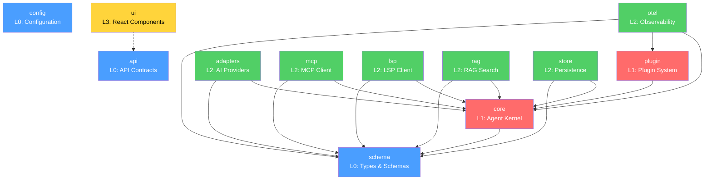
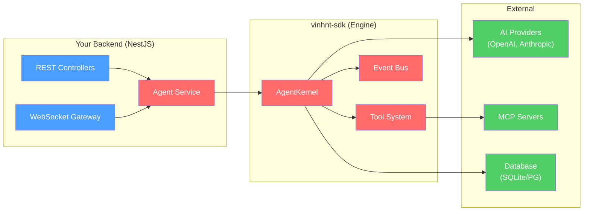

# vinhnt-sdk Documentation

> A modular, extensible SDK for building AI agent systems.

---

## What is vinhnt-sdk?

**vinhnt-sdk** is a collection of 12 npm packages that provide the **engine** for building AI agent systems. It contains types, schemas, business logic, and utility functions — but **no HTTP server or API layer**.

You use vinhnt-sdk as the foundation, then wrap it in your own backend (e.g., NestJS, Express) to expose REST/WebSocket APIs.

| What vinhnt-sdk provides | What you build |
|--------------------------|----------------|
| Agent runtime (`AgentKernel`) | HTTP/WebSocket server |
| Tool system (`defineTool`) | REST endpoints |
| Type schemas (Zod) | Authentication middleware |
| Model provider adapters | Database migrations |
| Persistence (Drizzle ORM) | Business logic layer |
| Observability (logging, tracing) | API documentation (Swagger) |

---

## Packages at a Glance

| Package | Description | npm |
|---------|-------------|-----|
| `@vinhnt-sdk/schema` | Zod schemas, branded IDs, event types | [npm](https://npmjs.com/package/@vinhnt-sdk/schema) |
| `@vinhnt-sdk/config` | Typed configuration, validation | [npm](https://npmjs.com/package/@vinhnt-sdk/config) |
| `@vinhnt-sdk/core` | Agent kernel, tool system, sessions | [npm](https://npmjs.com/package/@vinhnt-sdk/core) |
| `@vinhnt-sdk/adapters` | AI model providers (OpenAI, Anthropic, ...) | [npm](https://npmjs.com/package/@vinhnt-sdk/adapters) |
| `@vinhnt-sdk/mcp` | MCP client pool, ACP bridge | [npm](https://npmjs.com/package/@vinhnt-sdk/mcp) |
| `@vinhnt-sdk/lsp` | LSP client pool, code intelligence | [npm](https://npmjs.com/package/@vinhnt-sdk/lsp) |
| `@vinhnt-sdk/rag` | RAG indexing, semantic search | [npm](https://npmjs.com/package/@vinhnt-sdk/rag) |
| `@vinhnt-sdk/store` | Drizzle ORM persistence (SQLite/PG) | [npm](https://npmjs.com/package/@vinhnt-sdk/store) |
| `@vinhnt-sdk/otel` | Logging, tracing, audit | [npm](https://npmjs.com/package/@vinhnt-sdk/otel) |
| `@vinhnt-sdk/plugin` | Plugin SDK, npm loader | [npm](https://npmjs.com/package/@vinhnt-sdk/plugin) |
| `@vinhnt-sdk/api` | WebSocket/REST API contracts | [npm](https://npmjs.com/package/@vinhnt-sdk/api) |
| `@vinhnt-sdk/ui` | React component library | [npm](https://npmjs.com/package/@vinhnt-sdk/ui) |

---

## Architecture

### Dependency Graph

### Layer Model

| Layer | Packages | Purpose |
|-------|----------|---------|
| **L0: Foundation** | `schema`, `config`, `api` | Types, contracts, configuration. Zero internal dependencies. |
| **L1: Core** | `core`, `plugin` | Agent runtime, tool system, plugin system. |
| **L2: Subsystems** | `adapters`, `mcp`, `lsp`, `rag`, `store`, `otel` | Domain-specific functionality. |
| **L3: Consumer** | `ui` | End-user facing React components. |

### How It Fits Together

---

## Getting Started

- **[Quick Start](./guides/quick-start.md)** — Get up and running in 5 minutes
- **[Installation](./guides/installation.md)** — Package installation and setup
- **[Configuration](./guides/configuration.md)** — Config file format and options

## Guides

- **[Architecture](./guides/architecture.md)** — System design, dependency graph, layer model
- **[NestJS Integration](./guides/nestjs-integration.md)** — Building a NestJS backend with vinhnt-sdk
- **[Creating Tools](./guides/creating-tools.md)** — How to define custom tools
- **[Plugin Development](./guides/plugins.md)** — Writing and loading plugins
- **[MCP Integration](./guides/mcp.md)** — Connecting to MCP tool servers
- **[Persistence](./guides/persistence.md)** — Setting up database storage
- **[Observability](./guides/observability.md)** — Logging, tracing, and auditing

## Package Reference

- [schema](./packages/schema.md) | [config](./packages/config.md) | [core](./packages/core.md)
- [adapters](./packages/adapters.md) | [mcp](./packages/mcp.md) | [lsp](./packages/lsp.md)
- [rag](./packages/rag.md) | [store](./packages/store.md) | [otel](./packages/otel.md)
- [plugin](./packages/plugin.md) | [api](./packages/api.md) | [ui](./packages/ui.md)

## Examples

- [Minimal Agent](./examples/minimal-agent.md) — Simplest possible agent setup
- [Custom Tools](./examples/custom-tools.md) — Building tools that call external APIs
- [MCP Agent](./examples/mcp-agent.md) — Agent with MCP tool servers
- [Full Stack](./examples/full-stack.md) — Complete agent platform with NestJS

---

## License

MIT
