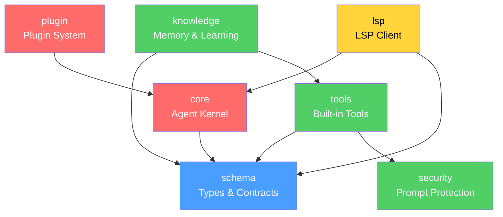
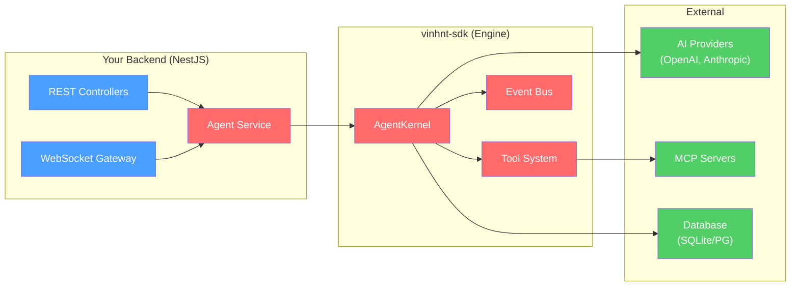

# vinhnt-sdk Documentation

> A modular, extensible SDK for building AI agent systems.

---

## What is vinhnt-sdk?

**vinhnt-sdk** is a collection of 7 npm packages that provide the **engine** for building AI agent systems. It contains types, schemas, business logic, and utility functions — but **no HTTP server or API layer**.

You use vinhnt-sdk as the foundation, then wrap it in your own backend (e.g., NestJS, Express) to expose REST/WebSocket APIs.

| What vinhnt-sdk provides | What you build |
|--------------------------|----------------|
| Agent runtime (`AgentKernel`) | HTTP/WebSocket server |
| Tool system (`defineTool`) | REST endpoints |
| Type schemas (Zod) | Authentication middleware |
| Model provider interfaces | Database migrations |
| Security (prompt protection, secret redaction) | Business logic layer |
| LSP integration | API documentation (Swagger) |

---

## Packages at a Glance

| Package | Description | npm |
|---------|-------------|-----|
| `@vinhnt-sdk/schema` | Types, contracts, model interfaces | [npm](https://npmjs.com/package/@vinhnt-sdk/schema) |
| `@vinhnt-sdk/core` | Agent kernel, orchestration, workflows | [npm](https://npmjs.com/package/@vinhnt-sdk/core) |
| `@vinhnt-sdk/tools` | Built-in tools (file, shell, git, web) | [npm](https://npmjs.com/package/@vinhnt-sdk/tools) |
| `@vinhnt-sdk/knowledge` | Memory, compression, learning engine | [npm](https://npmjs.com/package/@vinhnt-sdk/knowledge) |
| `@vinhnt-sdk/security` | Prompt injection protection, secret redaction | [npm](https://npmjs.com/package/@vinhnt-sdk/security) |
| `@vinhnt-sdk/plugin` | Plugin SDK, npm loader | [npm](https://npmjs.com/package/@vinhnt-sdk/plugin) |
| `@vinhnt-sdk/lsp` | LSP client pool, code intelligence | [npm](https://npmjs.com/package/@vinhnt-sdk/lsp) |

---

## Architecture

### Dependency Graph

### Layer Model

| Layer | Packages | Purpose |
|-------|----------|---------|
| **Foundation** | `schema` | Types, contracts, model interfaces. Zero internal dependencies. |
| **Core** | `core`, `plugin` | Agent runtime, orchestration, plugin system. |
| **Tools** | `tools`, `knowledge`, `security` | Built-in tools, memory, security. |
| **Integrations** | `lsp` | Protocol integrations. |

### How It Fits Together

---

## Getting Started

- **[Quick Start](./guides/quick-start.md)** — Get up and running in 5 minutes
- **[Installation](./guides/installation.md)** — Package installation and setup
- **[Configuration](./guides/configuration.md)** — Config file format and options

## Guides

- **[Architecture](./guides/architecture.md)** — System design, dependency graph, layer model
- **[Creating Tools](./guides/creating-tools.md)** — How to define custom tools
- **[Plugin Development](./guides/plugins.md)** — Writing and loading plugins

## Package Reference

- [schema](./packages/schema.md) | [core](./packages/core.md) | [tools](./packages/tools.md)
- [knowledge](./packages/knowledge.md) | [security](./packages/security.md)
- [plugin](./packages/plugin.md) | [lsp](./packages/lsp.md)

## Examples

- [Minimal Agent](./examples/minimal-agent.md) — Simplest possible agent setup
- [Custom Tools](./examples/custom-tools.md) — Building tools that call external APIs

---

## License

MIT
