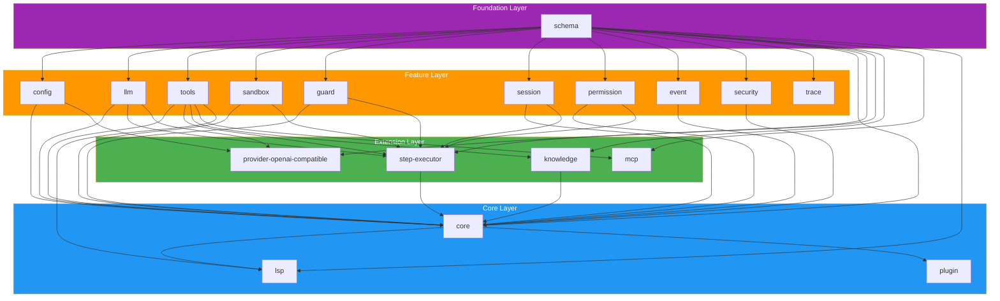

# Dependency Graph

## Overview

vinhnt-sdk is composed of **18 packages** organized in a strict layered architecture. The dependency graph follows a Directed Acyclic Graph (DAG) structure with no circular dependencies.



## Layer Legend

| Layer | Color | Description |
|-------|-------|-------------|
| Foundation | Purple | `schema` — type definitions shared by all packages |
| Feature | Orange | Single-dependency packages providing isolated capabilities |
| Extension | Green | Multi-dependency packages composing feature packages |
| Core | Blue | Aggregation packages with wide dependency surface |

## Package Count Summary

- **Foundation**: 1 package
- **Feature**: 12 packages
- **Extension**: 4 packages
- **Core**: 3 packages (including `plugin`)
- **Total**: 18 packages

## DAG Verification

The dependency graph is verified as a DAG at CI time using `ts-prune` and custom cycle detection. No circular dependencies exist:

- Every dependency edge flows from lower to higher layers
- `schema` is the only package with zero inbound dependencies
- `core` has the widest inbound dependency surface (12 packages)
- No package at layer N depends on a package at layer N+1 or higher

## Package Dependency Table

| Package | Dependencies |
|---------|-------------|
| `schema` | _(none)_ |
| `config` | `schema` |
| `llm` | `schema` |
| `tools` | `schema` |
| `sandbox` | `schema` |
| `guard` | `schema` |
| `session` | `schema` |
| `permission` | `schema` |
| `event` | `schema` |
| `security` | `schema` |
| `trace` | `schema` |
| `knowledge` | `schema`, `tools` |
| `mcp` | `schema`, `tools` |
| `provider-openai-compatible` | `schema`, `config`, `llm` |
| `step-executor` | `schema`, `llm`, `tools`, `sandbox`, `guard`, `session`, `permission` |
| `core` | `schema`, `config`, `llm`, `tools`, `sandbox`, `guard`, `session`, `permission`, `step-executor`, `event`, `knowledge`, `security` |
| `lsp` | `schema`, `tools`, `core` |
| `plugin` | `core` |

## How to Extend

To add a new package to vinhnt-sdk:

1. Create a new package directory under `packages/`
2. Add only `schema` as a dependency in `package.json`
3. Import types from `@vinhnt-sdk/schema` for all shared interfaces
4. If the package needs orchestration features, depend on `core` instead
5. Register the package in the workspace root `package.json`
6. Add the package to the CI dependency graph check

```jsonc
// packages/my-new-package/package.json
{
  "name": "@vinhnt-sdk/my-new-package",
  "dependencies": {
    "@vinhnt-sdk/schema": "workspace:*"
  }
}
```

This ensures your package remains decoupled from the rest of the SDK and can be used independently.
