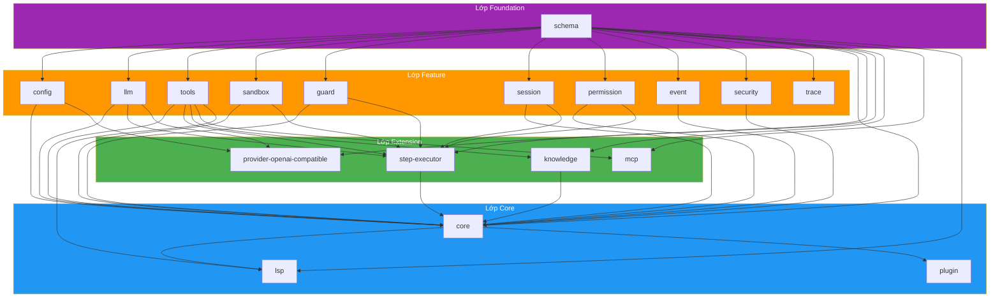

# Đồ thị phụ thuộc

## Tổng quan

vinhnt-sdk bao gồm **18 package** được tổ chức theo kiến trúc phân lớp chặt chẽ. Đồ thị phụ thuộc tuân theo cấu trúc Directed Acyclic Graph (DAG) không có phụ thuộc vòng.



## Chú thích lớp

| Lớp | Màu | Mô tả |
|-----|-----|-------|
| Foundation | Tím | `schema` — định dạng type được chia sẻ bởi tất cả package |
| Feature | Cam | Các package phụ thuộc đơn lẻ cung cấp khả năng cô lập |
| Extension | Xanh lá | Các package đa phụ thuộc tổng hợp các package feature |
| Core | Xanh dương | Các package tổng hợp có phạm vi phụ thuộc rộng |

## Tóm tắt số lượng package

- **Foundation**: 1 package
- **Feature**: 12 package
- **Extension**: 4 package
- **Core**: 3 package (bao gồm `plugin`)
- **Tổng cộng**: 18 package

## Xác minh DAG

Đồ thị phụ thuộc được xác minh là DAG tại CI sử dụng `ts-prune` và kiểm tra vòng lặp tùy chỉnh. Không có phụ thuộc vòng:

- Mọi cạnh phụ thuộc đều chảy từ lớp thấp hơn đến lớp cao hơn
- `schema` là package duy nhất không có phụ thuộc inbound
- `core` có phạm vi phụ thuộc inbound rộng nhất (12 package)
- Không có package ở lớp N nào phụ thuộc vào package ở lớp N+1 hoặc cao hơn

## Bảng phụ thuộc package

| Package | Các phụ thuộc |
|---------|--------------|
| `schema` | _(không có)_ |
| `config` | `schema` |
| `llm` | `schema` |
| `tools` | `schema` |
| `sandbox` | `schema` |
| `guard` | `schema` |
| `session` | `schema` |
| `permission` | `schema` |
| `event` | `schema` |
| `security` | `schema` |
| `trace` | `schema` |
| `knowledge` | `schema`, `tools` |
| `mcp` | `schema`, `tools` |
| `provider-openai-compatible` | `schema`, `config`, `llm` |
| `step-executor` | `schema`, `llm`, `tools`, `sandbox`, `guard`, `session`, `permission` |
| `core` | `schema`, `config`, `llm`, `tools`, `sandbox`, `guard`, `session`, `permission`, `step-executor`, `event`, `knowledge`, `security` |
| `lsp` | `schema`, `tools`, `core` |
| `plugin` | `core` |

## Cách mở rộng

Để thêm package mới vào vinhnt-sdk:

1. Tạo thư mục package mới trong `packages/`
2. Chỉ thêm `schema` làm phụ thuộc trong `package.json`
3. Nhập types từ `@vinhnt-sdk/schema` cho tất cả interfaces chung
4. Nếu package cần tính năng orchestration, hãy phụ thuộc vào `core` thay vào đó
5. Đăng ký package trong `package.json` gốc workspace
6. Thêm package vào kiểm tra đồ thị phụ thuộc CI

```jsonc
// packages/my-new-package/package.json
{
  "name": "@vinhnt-sdk/my-new-package",
  "dependencies": {
    "@vinhnt-sdk/schema": "workspace:*"
  }
}
```

Điều này đảm bảo package của bạn được tách biệt khỏi phần còn lại của SDK và có thể được sử dụng độc lập.
