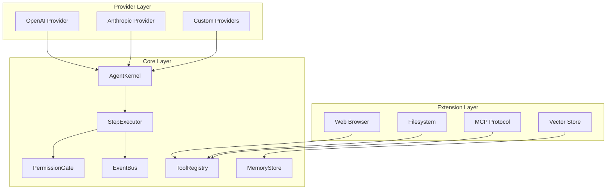
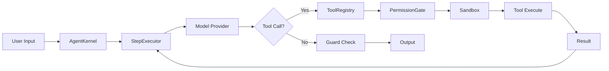
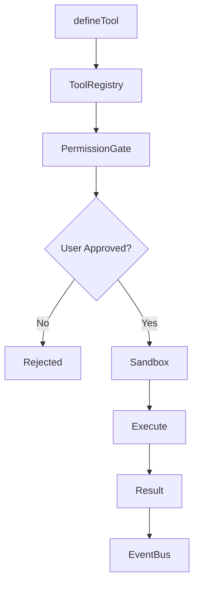
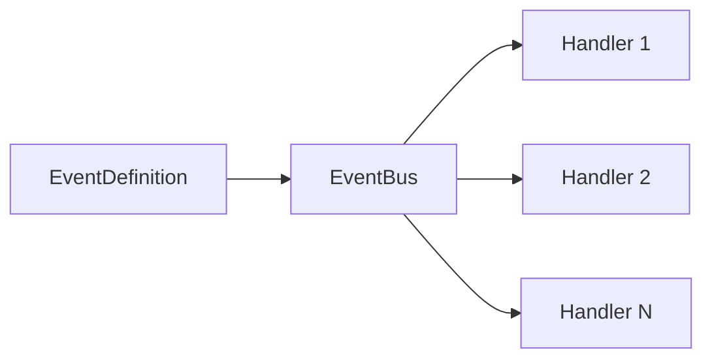
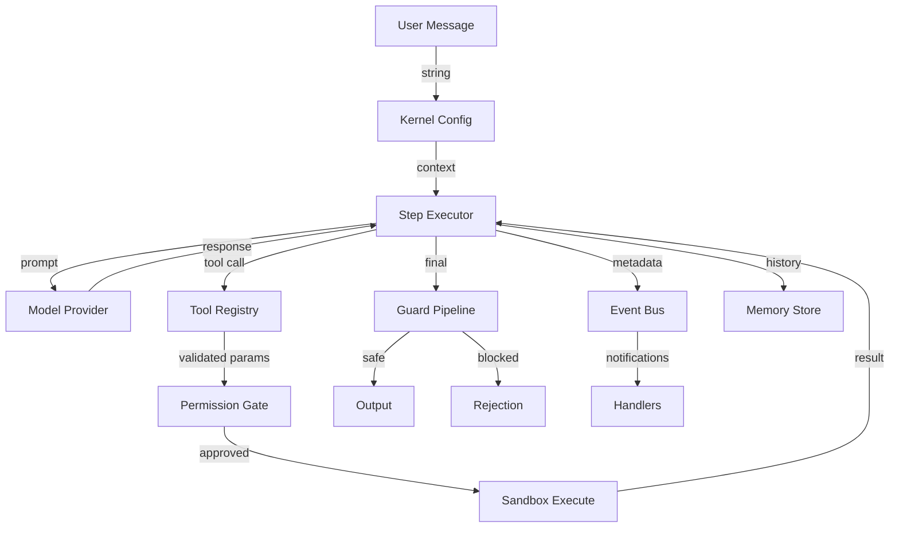

## Design Principles

vinhnt-sdk is built on four foundational principles that guide every architectural decision.

### Dependency Injection

All dependencies are injected rather than imported directly. This enables testability, modularity, and runtime flexibility.

```ts
const kernel = createKernel({
  model: openaiProvider({ apiKey: process.env.OPENAI_API_KEY }),
  tools: [searchTool, calculatorTool],
});
```

### No Hardcoded Values

Configuration, prompts, model parameters, and endpoint URLs are never hardcoded. Everything flows through configuration objects and environment variables.

### User Decisions

The agent cannot make autonomous decisions about destructive actions. Users retain control through permission gates and confirmation prompts.

### Extensibility

Every layer can be extended or replaced. Custom providers, tools, guards, and plugins integrate through well-defined interfaces.

## Package Ecosystem

The SDK consists of **18 packages** organized into two tiers.

| Tier | Packages | Purpose |
|------|----------|---------|
| Core (11) | kernel, agent, model, tool, memory, event, guard, config, provider, adapter, shared | Foundational runtime |
| Extension (7) | openai, anthropic, pinecone, web-browser, filesystem, mcp, logger | Platform integrations |

## High-Level Architecture



## Kernel Run-Loop

The kernel orchestrates the agent execution cycle. Each iteration processes one step through the pipeline.



**Step-by-step flow:**

1. **User Input** — Raw message enters the kernel
2. **AgentKernel** — Loads configuration, initializes context
3. **StepExecutor** — Manages single-step execution and history
4. **Model Provider** — Sends prompt to LLM, receives response
5. **Tool Call Decision** — Checks if model requests a tool invocation
6. **Tool Execution** — Resolves tool, checks permissions, runs in sandbox
7. **Guard Check** — Validates output against safety rules
8. **Output** — Returns final response or loops back for next step

## Tool System Flow

Tools are registered, validated, gated, and executed through a structured pipeline.



**Key stages:**

- **defineTool** — Declare tool schema, parameters, and handler
- **ToolRegistry** — Store and lookup tools by name
- **PermissionGate** — Check if tool requires user confirmation
- **Sandbox** — Isolate execution with resource limits
- **Execute** — Run tool handler with validated parameters
- **Result** — Return structured output to the step executor

## Event System

The event bus enables decoupled communication between components.



Events are typed and strongly defined. Handlers subscribe to specific event names and receive payloads matching the event schema.

```ts
const toolCalled = defineEvent<{
  toolName: string;
  params: Record<string, unknown>;
  timestamp: number;
}>("tool:called");

eventBus.on(toolCalled, (payload) => {
  logger.info(`Tool ${payload.toolName} invoked`);
});
```

## Data Flow



## Related Pages

- [Dependency Graph](/architecture/dependency-graph) — Full package dependency map
- [Design Patterns](/architecture/design-patterns) — Patterns used across the SDK
- [Package Layers](/architecture/package-layers) — Detailed layer breakdown
