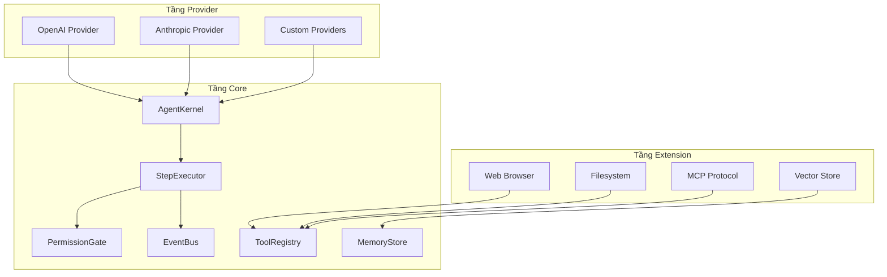
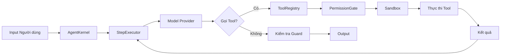
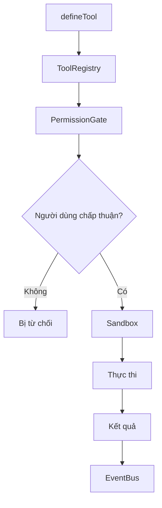
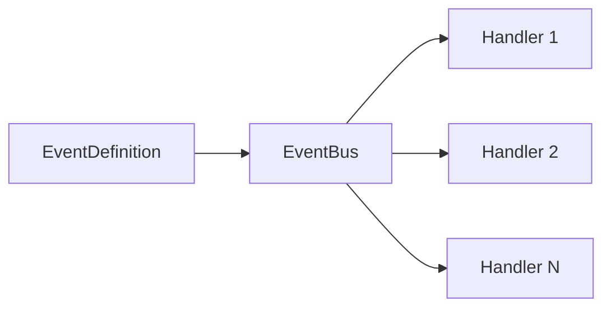
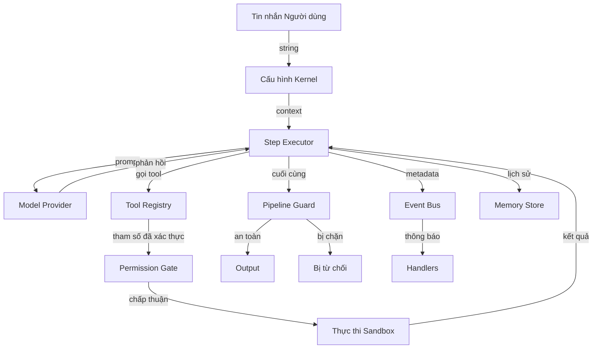

## Nguyên tắc thiết kế

vinhnt-sdk được xây dựng trên bốn nguyên tắc nền tảng, chi phối mọi quyết định kiến trúc.

### Injection phụ thuộc

Tất cả phụ thuộc được inject thay vì import trực tiếp. Điều này giúp kiểm thử, tính mô-đun và linh hoạt thời gian chạy.

```ts
const kernel = createKernel({
  model: openaiProvider({ apiKey: process.env.OPENAI_API_KEY }),
  tools: [searchTool, calculatorTool],
});
```

### Không hardcode giá trị

Cấu hình, prompt, tham số model và URL endpoint không bao giờ được hardcode. Mọi thứ thông qua đối tượng cấu hình và biến môi trường.

### Quyết định của người dùng

Agent không thể tự động đưa ra quyết định về hành động phá hủy. Người dùng giữ quyền kiểm soát thông qua cổng xác nhận và nhắc nhở.

### Mở rộng

Mỗi lớp có thể được mở rộng hoặc thay thế. Provider, tool, guard và plugin tùy chỉnh tích hợp thông qua giao diện được xác định rõ.

## Hệ sinh thái gói

SDK gồm **18 gói** được tổ chức thành hai tầng.

| Tầng | Gói | Mục đích |
|------|-----|----------|
| Core (11) | kernel, agent, model, tool, memory, event, guard, config, provider, adapter, shared | Runtime nền tảng |
| Extension (7) | openai, anthropic, pinecone, web-browser, filesystem, mcp, logger | Tích hợp nền tảng |

## Kiến trúc tổng quan



## Vòng lặp Kernel

Kernel điều phối chu kỳ thực thi agent. Mỗi lần lặp xử lý một bước qua pipeline.



**Luồng từng bước:**

1. **Input Người dùng** — Tin nhắn thô enters kernel
2. **AgentKernel** — Tải cấu hình, khởi tạo context
3. **StepExecutor** — Quản lý thực thi đơn bước và lịch sử
4. **Model Provider** — Gửi prompt đến LLM, nhận phản hồi
5. **Quyết định gọi Tool** — Kiểm tra model có yêu cầu gọi tool không
6. **Thực thi Tool** — Giải quyết tool, kiểm tra quyền, chạy trong sandbox
7. **Kiểm tra Guard** — Xác thực output theo quy tắc an toàn
8. **Output** — Trả về phản hồi cuối cùng hoặc lặp lại bước tiếp theo

## Luồng Hệ thống Tool

Tool được đăng ký, xác thực, kiểm soát và thực thi qua pipeline có cấu trúc.



**Các giai đoạn chính:**

- **defineTool** — Khai báo schema tool, tham số và handler
- **ToolRegistry** — Lưu trữ và tìm tool theo tên
- **PermissionGate** — Kiểm tra tool có cần xác nhận người dùng không
- **Sandbox** — Cô lập thực thi với giới hạn tài nguyên
- **Thực thi** — Chạy handler tool với tham số đã xác thực
- **Kết quả** — Trả về output có cấu trúc cho step executor

## Hệ thống Event

Event bus cho phép giao tiếp phi kết nối giữa các thành phần.



Event được định nghĩa rõ ràng và có kiểu dữ liệu. Handler đăng ký theo tên event cụ thể và nhận payload phù hợp với schema.

```ts
const toolCalled = defineEvent<{
  toolName: string;
  params: Record<string, unknown>;
  timestamp: number;
}>("tool:called");

eventBus.on(toolCalled, (payload) => {
  logger.info(`Tool ${payload.toolName} đã được gọi`);
});
```

## Dòng dữ liệu



## Trang liên quan

- [Đồ thị phụ thuộc](/architecture/dependency-graph) — Bản đồ phụ thuộc đầy đủ giữa các gói
- [Mẫu thiết kế](/architecture/design-patterns) — Các mẫu được sử dụng trong SDK
- [Lớp gói](/architecture/package-layers) — Phân tích chi tiết các lớp
