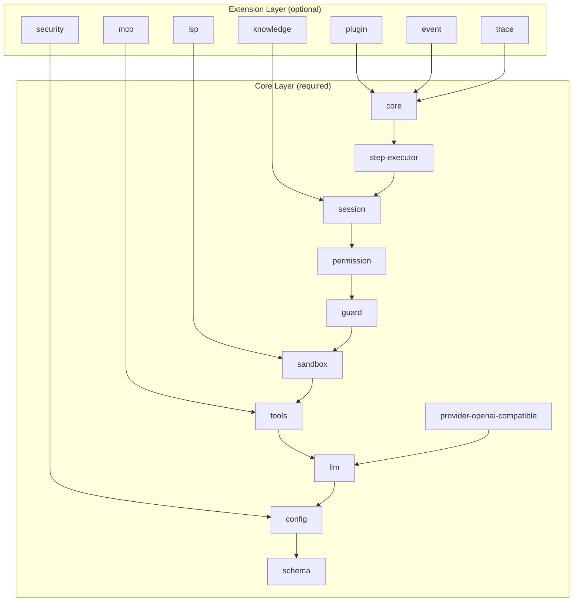

# Package Layers

vinhnt-sdk is organized into two distinct layers: **Core** (required) and **Extension** (optional). This layered architecture enforces clear dependency boundaries and enables incremental adoption.

## Layer Model



## Core Layer (11 packages — required)

The Core Layer contains every package essential for a working agent runtime.

| Package | Role | Why Required |
|---|---|---|
| `schema` | Types, contracts, branded IDs | Shared type system; zero runtime deps |
| `config` | Credentials, env, settings | Every agent needs configuration |
| `llm` | LLM adapter abstraction | Unified interface to any model provider |
| `tools` | Tool framework + built-in tools | Agents must invoke tools to act |
| `sandbox` | Process isolation | Execute untrusted code safely |
| `guard` | Circuit breaker, timeout | Prevent runaway executions |
| `session` | Session state management | Track conversation and agent state |
| `permission` | Permission rules | Control tool access per role |
| `step-executor` | Execution kernel | Run individual agent steps |
| `core` | AgentKernel, orchestration | Top-level agent lifecycle |
| `provider-openai-compatible` | OpenAI provider + presets | Default LLM provider for most users |

## Extension Layer (7 packages — optional)

Extensions add capabilities that not every agent needs.

| Package | Role | When to Add |
|---|---|---|
| `plugin` | Plugin hooks, loader | You need a plugin system |
| `knowledge` | Memory, compression | Agent requires long-term recall |
| `event` | Event bus, durable replay | Multi-agent or event-driven flows |
| `mcp` | MCP integration | Connect to external MCP servers |
| `trace` | Telemetry, timeline | Production observability needed |
| `security` | Secret redactor | Agent handles sensitive data |
| `lsp` | LSP integration | Agent writes or edits code |

## Minimum Viable Install

A working agent with minimal footprint:

```bash
npm install @vinhnt-sdk/schema @vinhnt-sdk/core @vinhnt-sdk/tools
```

These three packages pull in their transitive core dependencies and produce a fully functional agent.

## Full Install

All 18 packages:

```bash
npm install \
  @vinhnt-sdk/schema \
  @vinhnt-sdk/config \
  @vinhnt-sdk/llm \
  @vinhnt-sdk/tools \
  @vinhnt-sdk/sandbox \
  @vinhnt-sdk/guard \
  @vinhnt-sdk/session \
  @vinhnt-sdk/permission \
  @vinhnt-sdk/step-executor \
  @vinhnt-sdk/core \
  @vinhnt-sdk/provider-openai-compatible \
  @vinhnt-sdk/plugin \
  @vinhnt-sdk/knowledge \
  @vinhnt-sdk/event \
  @vinhnt-sdk/mcp \
  @vinhnt-sdk/trace \
  @vinhnt-sdk/security \
  @vinhnt-sdk/lsp
```

## Creating a New Extension Package

1. Create `packages/<name>` with `package.json` scoped to `@vinhnt-sdk/<name>`.
2. Import only from Core Layer packages. Never import from sibling extensions.
3. Export a `register(plugin)` function that hooks into the Core kernel.
4. Add tests covering the hook contract.

```ts
// packages/my-ext/src/index.ts
import { defineExtension } from "@vinhnt-sdk/core";

export default defineExtension({
  name: "my-ext",
  setup(kernel) {
    kernel.hook("beforeStep", async (ctx) => {
      // custom logic
    });
  },
});
```

## Dependency Rules

- **Extensions may depend on Core packages** — never the reverse.
- **Extensions must not depend on other extensions** — use the event bus for cross-extension communication.
- **Core packages must not import from the Extension Layer** — this keeps the core tree-shakable and lean.

Violations of these rules will be caught by the CI dependency graph check.
