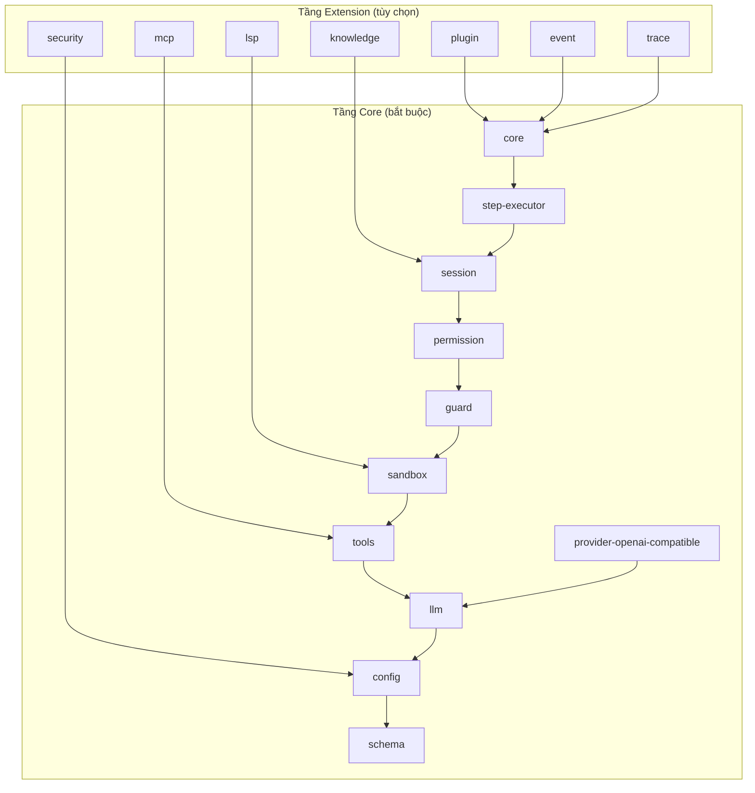

# Tầng Package

vinhnt-sdk được tổ chức thành hai tầng riêng biệt: **Core** (bắt buộc) và **Extension** (tùy chọn). Kiến trúc phân tầng này đảm bảo ranh giới phụ thuộc rõ ràng và cho phép áp dụng dần dần.

## Mô Hình Tầng



## Tầng Core (11 package — bắt buộc)

Tầng Core chứa mọi package cần thiết để runtime agent hoạt động.

| Package | Vai trò | Tại sao bắt buộc |
|---|---|---|
| `schema` | Kiểu, hợp đồng, ID branded | Hệ thống kiểu chung; không phụ thuộc runtime |
| `config` | Thông tin đăng nhập, env, settings | Mọi agent đều cần cấu hình |
| `llm` | Trừu tượng hóa adapter LLM | Giao diện thống nhất cho mọi nhà cung cấp mô hình |
| `tools` | Framework tool + tool tích hợp sẵn | Agent phải gọi tool để thực hiện hành động |
| `sandbox` | Cách ly process | Thực thi code không đáng tin cậy một cách an toàn |
| `guard` | Circuit breaker, timeout | Ngăn chặn thực thi chạy mãi |
| `session` | Quản lý trạng thái session | Theo dõi trạng thái hội thoại và agent |
| `permission` | Quy tắc quyền truy cập | Kiểm soát truy cập tool theo vai trò |
| `step-executor` | Kernel thực thi | Chạy từng bước của agent |
| `core` | AgentKernel, orchestration | Vòng đời agent cấp cao nhất |
| `provider-openai-compatible` | Nhà cung cấp OpenAI + preset | Nhà cung cấp LLM mặc định cho多数 người dùng |

## Tầng Extension (7 package — tùy chọn)

Extension thêm khả năng mà không phải agent nào cũng cần.

| Package | Vai trò | Khi nào cần thêm |
|---|---|---|
| `plugin` | Hook plugin, loader | Cần hệ thống plugin |
| `knowledge` | Bộ nhớ, nén | Agent cần nhớ dài hạn |
| `event` | Event bus, replay bền vững | Agent đa luồng hoặc luồng sự kiện |
| `mcp` | Tích hợp MCP | Kết nối với server MCP bên ngoài |
| `trace` | Telemetry, timeline | Cần quan sát production |
| `security` | Redactor bí mật | Agent xử lý dữ liệu nhạy cảm |
| `lsp` | Tích hợp LSP | Agent viết hoặc chỉnh sửa code |

## Cài Đặt Tối Thiểu

Một agent hoạt động với dung lượng nhỏ nhất:

```bash
npm install @vinhnt-sdk/schema @vinhnt-sdk/core @vinhnt-sdk/tools
```

Ba package này kéo theo các phụ thuộc Core transitive và tạo ra agent hoạt động đầy đủ.

## Cài Đặt Đầy Đủ

Tất cả 18 package:

```bash
npm install \
  @vinhnt-sdk/schema \
  @vinhnt-sdk/config \
  @vinhnt-sdk/llm \
  @vinhnt-sdk/tools \
  @vinhnt-sdk/sandbox \
  @vinhnt-sdk/guard \
  @vinhnt-sdk/session \
  @vinhnt-sdk/permission \
  @vinhnt-sdk/step-executor \
  @vinhnt-sdk/core \
  @vinhnt-sdk/provider-openai-compatible \
  @vinhnt-sdk/plugin \
  @vinhnt-sdk/knowledge \
  @vinhnt-sdk/event \
  @vinhnt-sdk/mcp \
  @vinhnt-sdk/trace \
  @vinhnt-sdk/security \
  @vinhnt-sdk/lsp
```

## Tạo Package Extension Mới

1. Tạo `packages/<name>` với `package.json` thuộc scope `@vinhnt-sdk/<name>`.
2. Chỉ import từ các package Core Layer. Không bao giờ import từ extension anh em.
3. Xuất hàm `register(plugin)` hook vào kernel Core.
4. Thêm test bao phủ hợp đồng hook.

```ts
// packages/my-ext/src/index.ts
import { defineExtension } from "@vinhnt-sdk/core";

export default defineExtension({
  name: "my-ext",
  setup(kernel) {
    kernel.hook("beforeStep", async (ctx) => {
      // logic tùy chỉnh
    });
  },
});
```

## Quy Tắc Phụ Thuộc

- **Extension được phép phụ thuộc vào Core** — không bao giờ ngược lại.
- **Extension không được phụ thuộc vào extension khác** — dùng event bus để giao tiếp liên extension.
- **Core không được import từ Extension** — giúp core tree-shakable và gọn nhẹ.

Vi phạm các quy tắc này sẽ bị CI dependency graph check phát hiện.
