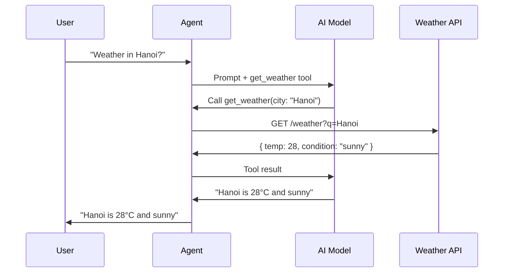

# Example: Custom Tools

> Building tools that call external APIs.

---

## Flow



## weather-tool.ts

```typescript
import { defineTool } from "@vinhnt-sdk/core";
import { z } from "zod";

const WEATHER_API = "https://api.openweathermap.org/data/2.5";

export const getWeatherTool = defineTool({
  name: "get_weather",
  description: "Get current weather for a city. Returns temperature, condition, and humidity.",
  risk: "low",
  input: z.object({
    city: z.string().describe("City name, e.g. 'Hanoi' or 'Tokyo'"),
    units: z.enum(["metric", "imperial"]).default("metric"),
  }),
  execute: async (input) => {
    const response = await fetch(
      `${WEATHER_API}/weather?q=${encodeURIComponent(input.city)}&units=${input.units}&appid=${process.env.WEATHER_API_KEY}`
    );

    if (!response.ok) {
      return { error: `City not found: ${input.city}` };
    }

    const data = await response.json();

    return {
      city: data.name,
      temperature: data.main.temp,
      feelsLike: data.main.feels_like,
      humidity: data.main.humidity,
      condition: data.weather[0].main,
      description: data.weather[0].description,
    };
  },
});

export const forecastTool = defineTool({
  name: "get_forecast",
  description: "Get 5-day weather forecast for a city.",
  risk: "low",
  input: z.object({
    city: z.string(),
  }),
  execute: async (input) => {
    const response = await fetch(
      `${WEATHER_API}/forecast?q=${encodeURIComponent(input.city)}&appid=${process.env.WEATHER_API_KEY}`
    );

    const data = await response.json();

    return {
      city: data.city.name,
      forecast: data.list.slice(0, 5).map((item: any) => ({
        time: item.dt_txt,
        temp: item.main.temp,
        condition: item.weather[0].main,
      })),
    };
  },
});
```

## Usage

```typescript
import { AgentKernel, NullRunEventStore } from "@vinhnt-sdk/core";
import { getWeatherTool, forecastTool } from "./weather-tool";

// Implement ModelProvider interface with your preferred AI SDK
const model = {
  id: "openai-gpt4o",
  provider: "openai",
  model: "gpt-4o",
  capabilities: { streaming: true, toolCalling: true, vision: false },
  async *stream(request) {
    // Implement with Vercel AI SDK, OpenAI SDK, etc.
  },
};

const kernel = new AgentKernel({
  model,
  tools: [getWeatherTool, forecastTool],
  store: new NullRunEventStore(),
});

const result = await kernel.run("What's the weather in Hanoi?");
```

## Tool with Authentication

```typescript
const githubTool = defineTool({
  name: "github_search",
  description: "Search GitHub repositories",
  risk: "low",
  input: z.object({
    query: z.string(),
    language: z.string().optional(),
  }),
  execute: async (input) => {
    const response = await fetch(
      `https://api.github.com/search/repositories?q=${encodeURIComponent(input.query)}${input.language ? `+language:${input.language}` : ""}`,
      {
        headers: {
          Authorization: `Bearer ${process.env.GITHUB_TOKEN}`,
          Accept: "application/vnd.github.v3+json",
        },
      }
    );

    const data = await response.json();

    return {
      total: data.total_count,
      repos: data.items.slice(0, 5).map((repo: any) => ({
        name: repo.full_name,
        description: repo.description,
        stars: repo.stargazers_count,
        url: repo.html_url,
      })),
    };
  },
});
```
