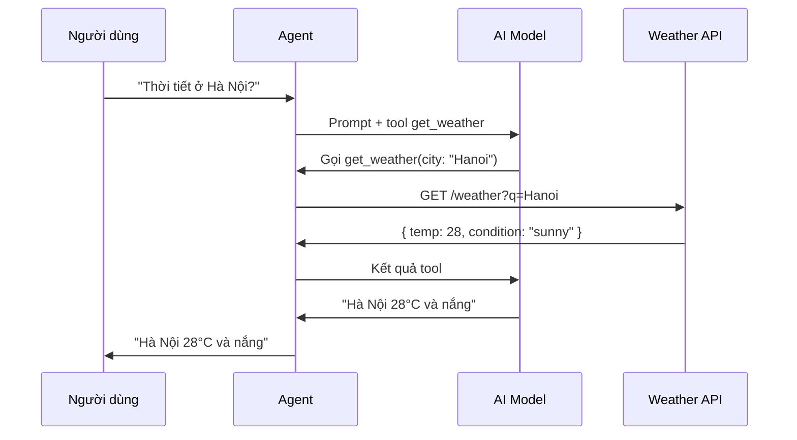

# Tool tùy chỉnh

Xây dựng tool gọi API bên ngoài như dịch vụ thời tiết và GitHub.

## Luồng xử lý



## weather-tool.ts

```typescript
import { defineTool } from "@vinhnt-sdk/tools";

const WEATHER_API = "https://api.openweathermap.org/data/2.5";

export const getWeatherTool = defineTool({
  name: "get_weather",
  description: "Lấy thời tiết hiện tại của thành phố. Trả về nhiệt độ, điều kiện và độ ẩm.",
  risk: "external",
  parameters: {
    type: "object",
    properties: {
      city: { type: "string", description: "Tên thành phố, ví dụ 'Hanoi' hoặc 'Tokyo'" },
      units: { type: "string", enum: ["metric", "imperial"], default: "metric" },
    },
    required: ["city"],
  },
  execute: async (params) => {
    const response = await fetch(
      `${WEATHER_API}/weather?q=${encodeURIComponent(params.city)}&units=${params.units}&appid=${process.env.WEATHER_API_KEY}`
    );

    if (!response.ok) {
      return { error: `Không tìm thấy thành phố: ${params.city}` };
    }

    const data = await response.json();

    return {
      city: data.name,
      temperature: data.main.temp,
      feelsLike: data.main.feels_like,
      humidity: data.main.humidity,
      condition: data.weather[0].main,
      description: data.weather[0].description,
    };
  },
});

export const forecastTool = defineTool({
  name: "get_forecast",
  description: "Lấy dự báo thời tiết 5 ngày cho một thành phố.",
  risk: "external",
  parameters: {
    type: "object",
    properties: {
      city: { type: "string", description: "Tên thành phố" },
    },
    required: ["city"],
  },
  execute: async (params) => {
    const response = await fetch(
      `${WEATHER_API}/forecast?q=${encodeURIComponent(params.city)}&appid=${process.env.WEATHER_API_KEY}`
    );

    const data = await response.json();

    return {
      city: data.city.name,
      forecast: data.list.slice(0, 5).map((item: any) => ({
        time: item.dt_txt,
        temp: item.main.temp,
        condition: item.weather[0].main,
      })),
    };
  },
});
```

## github-tool.ts

```typescript
import { defineTool } from "@vinhnt-sdk/tools";

export const githubSearchTool = defineTool({
  name: "github_search",
  description: "Tìm kiếm kho lưu trữ GitHub theo từ khóa và ngôn ngữ.",
  risk: "external",
  parameters: {
    type: "object",
    properties: {
      query: { type: "string", description: "Từ khóa tìm kiếm" },
      language: { type: "string", description: "Lọc theo ngôn ngữ lập trình" },
      limit: { type: "number", description: "Số kết quả tối đa trả về", default: 5 },
    },
    required: ["query"],
  },
  execute: async (params) => {
    const langFilter = params.language ? `+language:${params.language}` : "";
    const response = await fetch(
      `https://api.github.com/search/repositories?q=${encodeURIComponent(params.query)}${langFilter}`,
      {
        headers: {
          Authorization: `Bearer ${process.env.GITHUB_TOKEN}`,
          Accept: "application/vnd.github.v3+json",
        },
      }
    );

    const data = await response.json();

    return {
      total: data.total_count,
      repos: data.items.slice(0, params.limit).map((repo: any) => ({
        name: repo.full_name,
        description: repo.description,
        stars: repo.stargazers_count,
        url: repo.html_url,
      })),
    };
  },
});
```

## Cách sử dụng & Tổng hợp tool

```typescript
import { AgentKernel } from "@vinhnt-sdk/core";
import { defineTool } from "@vinhnt-sdk/tools";
import { NullRunEventStore } from "@vinhnt-sdk/session";
import { getWeatherTool, forecastTool } from "./weather-tool";
import { githubSearchTool } from "./github-tool";

const model = {
  id: "openai-gpt4o",
  provider: "openai",
  model: "gpt-4o",
  capabilities: { streaming: true, toolCalling: true, vision: false },
  async *stream(request: any) {
    // Triển khai với AI SDK bạn chọn
  },
};

const kernel = new AgentKernel({
  model,
  tools: [getWeatherTool, forecastTool, githubSearchTool],
  store: new NullRunEventStore(),
});

// Tool gọi các tool khác thông qua context
const tripPlannerTool = defineTool({
  name: "plan_trip",
  description: "Lên kế hoạch chuyến đi bằng cách kiểm tra thời tiết.",
  risk: "external",
  parameters: {
    type: "object",
    properties: {
      destination: { type: "string", description: "Thành phố đích" },
      date: { type: "string", description: "Ngày đi (YYYY-MM-DD)" },
    },
    required: ["destination", "date"],
  },
  execute: async (params, context) => {
    const weatherResult = await context.executeTool("get_weather", {
      city: params.destination,
    });
    return {
      destination: params.destination,
      date: params.date,
      weather: weatherResult,
      recommendation: weatherResult.temperature > 20
        ? "Thời tiết tuyệt vời cho chuyến đi!"
        : "Nên mang theo quần áo ấm.",
    };
  },
});

const weather = await kernel.run("Thời tiết ở Hà Nội thế nào?");
const repos = await kernel.run("Tìm project Rust phổ biến cho web server");
```

## Khái niệm chính

- **Risk `"external"`** — Dùng cho tool thực hiện HTTP request đến API bên thứ ba.
- **Xử lý lỗi** — Luôn kiểm tra `response.ok` và trả về đối tượng lỗi có cấu trúc.
- **Auth qua env vars** — Lưu API key trong biến môi trường, không bao giờ hardcode trong code.
- **`context.executeTool`** — Gọi tool khác từ trong tool để tổng hợp chức năng.
