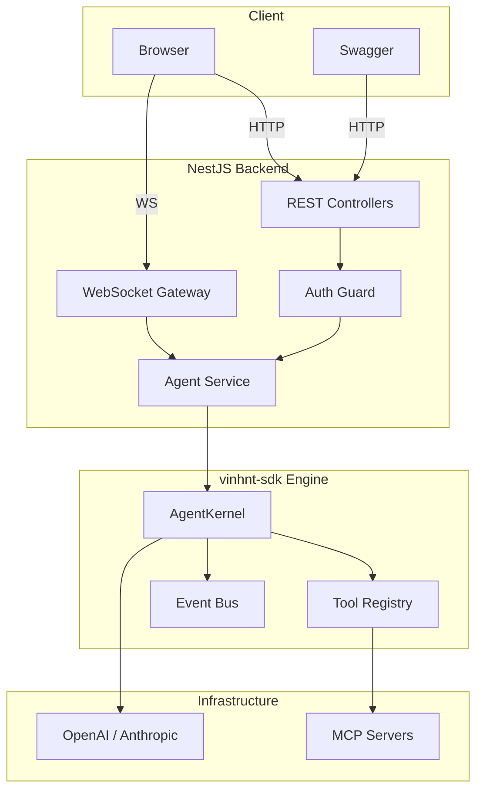

# Full Stack

Nền tảng agent hoàn chỉnh với NestJS, REST API, SSE streaming và WebSocket.

## Kiến trúc



## Thiết lập

```bash
npm install \
  @vinhnt-sdk/core @vinhnt-sdk/tools @vinhnt-sdk/session \
  @nestjs/common @nestjs/core @nestjs/platform-express \
  @nestjs/websockets @nestjs/platform-socket.io \
  @nestjs/swagger rxjs reflect-metadata
```

## Agent Service

```typescript
// src/agent/agent.service.ts
import { Injectable, OnModuleInit } from "@nestjs/common";
import { AgentKernel } from "@vinhnt-sdk/core";
import { NullRunEventStore } from "@vinhnt-sdk/session";

@Injectable()
export class AgentService implements OnModuleInit {
  private kernel!: AgentKernel;
  async onModuleInit() {
    const model = {
      id: "openai-gpt4o",
      provider: "openai",
      model: "gpt-4o",
      capabilities: { streaming: true, toolCalling: true, vision: false },
      async *stream(request: any) {
        // Triển khai với AI SDK bạn chọn
      },
    };
    this.kernel = new AgentKernel({
      model,
      tools: [],
      store: new NullRunEventStore(),
    });
  }

  async run(prompt: string, sessionId?: string) {
    const handle = this.kernel.run(prompt, { sessionId });
    return await handle.completed;
  }

  async *stream(prompt: string, sessionId?: string) {
    const handle = this.kernel.run(prompt, { sessionId });
    for await (const event of handle.events) {
      yield event;
    }
  }
}
```

## REST Controller

```typescript
// src/agent/agent.controller.ts
import { Controller, Post, Body, Sse } from "@nestjs/common";
import { ApiTags, ApiBearerAuth } from "@nestjs/swagger";
import { Observable } from "rxjs";
import { AgentService } from "./agent.service";

@ApiTags("Agent")
@ApiBearerAuth()
@Controller("agent")
export class AgentController {
  constructor(private readonly agentService: AgentService) {}

  @Post("run")
  async run(@Body() body: { prompt: string; sessionId?: string }) {
    return this.agentService.run(body.prompt, body.sessionId);
  }

  @Sse("stream")
  stream(@Body() body: { prompt: string }): Observable<any> {
    return new Observable((subscriber) => {
      this.agentService
        .stream(body.prompt)
        .then(async (gen) => {
          for await (const event of gen) subscriber.next(event);
          subscriber.complete();
        })
        .catch((err) => subscriber.error(err));
    });
  }
}
```

## WebSocket Gateway

```typescript
// src/agent/agent.gateway.ts
import { WebSocketGateway, WebSocketServer, SubscribeMessage, ConnectedSocket, MessageBody } from "@nestjs/websockets";
import { Server, Socket } from "socket.io";
import { AgentService } from "./agent.service";

@WebSocketGateway({ cors: true })
export class AgentGateway {
  @WebSocketServer() server!: Server;
  constructor(private readonly agentService: AgentService) {}

  @SubscribeMessage("agent:run")
  async handleRun(@ConnectedSocket() client: Socket, @MessageBody() data: { prompt: string; sessionId?: string }) {
    try {
      for await (const event of this.agentService.stream(data.prompt, data.sessionId)) {
        client.emit("agent:event", event);
      }
      client.emit("agent:done", { success: true });
    } catch (error) {
      client.emit("agent:error", { error: (error as Error).message });
    }
  }
}
```

## Module & Bootstrap

```typescript
// src/agent/agent.module.ts
import { Module } from "@nestjs/common";
import { AgentService } from "./agent.service";
import { AgentController } from "./agent.controller";
import { AgentGateway } from "./agent.gateway";

@Module({
  providers: [AgentService, AgentGateway],
  controllers: [AgentController],
  exports: [AgentService],
})
export class AgentModule {}

// src/main.ts
import { NestFactory } from "@nestjs/core";
import { ValidationPipe } from "@nestjs/common";
import { SwaggerModule, DocumentBuilder } from "@nestjs/swagger";
import { AppModule } from "./app.module";
async function bootstrap() {
  const app = await NestFactory.create(AppModule);
  app.setGlobalPrefix("api/v1");
  app.useGlobalPipes(new ValidationPipe({ transform: true }));
  app.enableCors();
  const config = new DocumentBuilder()
    .setTitle("Agent API")
    .setVersion("1.0")
    .addBearerAuth()
    .build();
  const document = SwaggerModule.createDocument(app, config);
  SwaggerModule.setup("api-doc", app, document);
  await app.listen(3000);
}
bootstrap();
```

## Chạy

```bash
npx tsx src/main.ts
# Server: http://localhost:3000
# Swagger: http://localhost:3000/api-doc
```

## Khái niệm chính
- **`AgentService`** — Injectable NestJS bao bọc `AgentKernel` với các phương thức `run` và `stream`.
- **`@Sse("stream")`** — Endpoint Server-Sent Events để streaming real-time đến browser.
- **WebSocket Gateway** — Giao tiếp hai chiều real-time qua Socket.IO.
- **`AgentModule`** — Cấu trúc module NestJS gọn gàng cho dependency injection.
