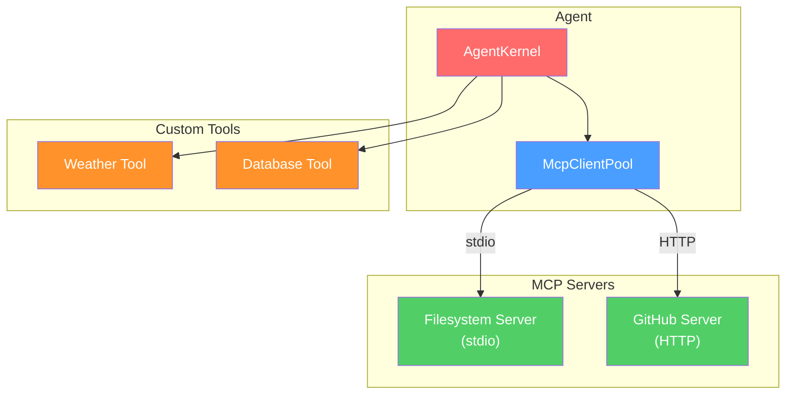

# Example: MCP Agent

> Agent that connects to MCP tool servers for external capabilities.

---

## Architecture



## mcp-servers.json

```json
{
  "servers": [
    {
      "name": "filesystem",
      "transport": "stdio",
      "command": "npx",
      "args": ["-y", "@modelcontextprotocol/server-filesystem", "/path/to/workspace"]
    },
    {
      "name": "github",
      "transport": "http",
      "url": "https://mcp-github.example.com",
      "headers": {
        "Authorization": "Bearer ${GITHUB_TOKEN}"
      }
    }
  ]
}
```

## agent.ts

```typescript
import { AgentKernel, NullRunEventStore } from "@vinhnt-sdk/core";
import { McpClientPool, loadMcpConfig } from "@vinhnt-sdk/mcp";

async function main() {
  // 1. Load MCP config
  const mcpConfig = loadMcpConfig("./mcp-servers.json");

  // 2. Create and connect MCP pool
  const mcpPool = new McpClientPool(mcpConfig);
  await mcpPool.connectAll();

  // 3. Get tools from MCP servers
  const mcpTools = mcpPool.getTools();
  console.log(`Loaded ${mcpTools.length} MCP tools`);

  // 4. Create model provider (implement ModelProvider interface)
  const model = {
    id: "openai-gpt4o",
    provider: "openai",
    model: "gpt-4o",
    capabilities: { streaming: true, toolCalling: true, vision: false },
    async *stream(request) {
      // Implement with your preferred AI SDK
    },
  };

  // 5. Create kernel with MCP tools
  const kernel = new AgentKernel({
    model,
    tools: mcpTools,
    store: new NullRunEventStore(),
  });

  // 6. Run
  const result = await kernel.run("List files in the current directory");
  console.log(result);

  // 7. Cleanup
  await mcpPool.disconnectAll();
}

main();
```

## Custom MCP Server

Create your own MCP server:

```typescript
import { Server } from "@modelcontextprotocol/server";
import { StdioServerTransport } from "@modelcontextprotocol/server/stdio";

const server = new Server({
  name: "my-app",
  version: "1.0.0",
});

server.tool("get_user", {
  description: "Get user by ID",
  inputSchema: {
    type: "object",
    properties: {
      userId: { type: "string" },
    },
    required: ["userId"],
  },
}, async (request) => {
  const user = await db.users.findById(request.params.userId);
  return {
    content: [{ type: "text", text: JSON.stringify(user) }],
  };
});

const transport = new StdioServerTransport();
await server.connect(transport);
```
