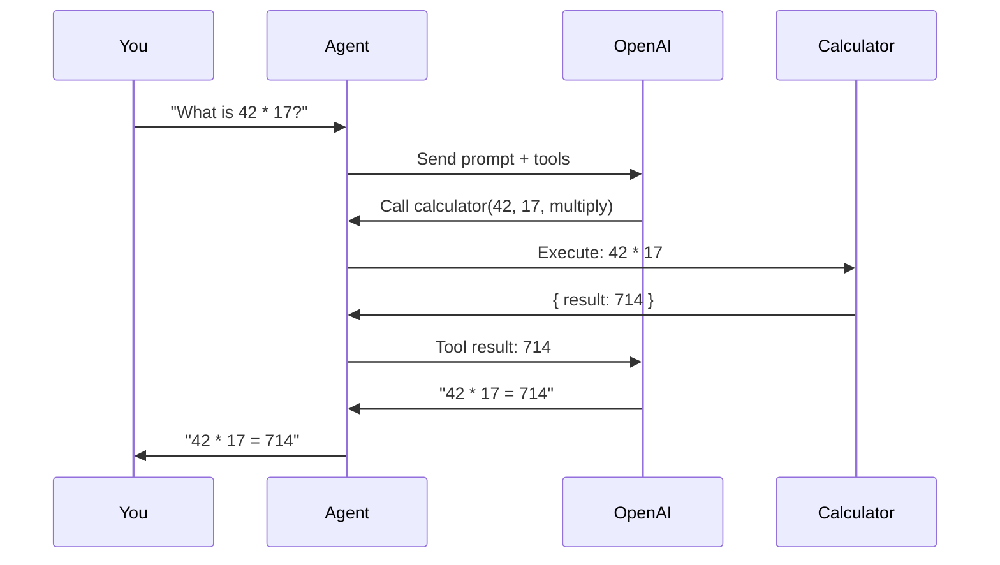

# Minimal Agent

The simplest possible agent setup with one custom tool.

## Flow



## package.json

```json
{
  "name": "minimal-agent",
  "version": "1.0.0",
  "type": "module",
  "scripts": {
    "start": "tsx agent.ts"
  },
  "dependencies": {
    "@vinhnt-sdk/core": "^0.1.3",
    "@vinhnt-sdk/tools": "^0.1.3",
    "@vinhnt-sdk/session": "^0.1.3",
    "zod": "^3.23.0"
  },
  "devDependencies": {
    "tsx": "^4.0.0",
    "typescript": "^5.5.0"
  }
}
```

## agent.ts

```typescript
import { AgentKernel } from "@vinhnt-sdk/core";
import { defineTool } from "@vinhnt-sdk/tools";
import { NullRunEventStore } from "@vinhnt-sdk/session";
import { z } from "zod";

// 1. Define a calculator tool
const calculatorTool = defineTool({
  name: "calculator",
  description: "Perform basic arithmetic. Use this for math questions.",
  risk: "read",
  parameters: {
    type: "object",
    properties: {
      operation: {
        type: "string",
        enum: ["add", "subtract", "multiply", "divide"],
        description: "The arithmetic operation to perform",
      },
      a: { type: "number", description: "First operand" },
      b: { type: "number", description: "Second operand" },
    },
    required: ["operation", "a", "b"],
  },
  execute: async (params) => {
    const results: Record<string, number> = {
      add: params.a + params.b,
      subtract: params.a - params.b,
      multiply: params.a * params.b,
      divide: params.a / params.b,
    };
    return { result: results[params.operation] };
  },
});

// 2. Create model provider
const model = {
  id: "openai-gpt4o",
  provider: "openai",
  model: "gpt-4o",
  capabilities: { streaming: true, toolCalling: true, vision: false },
  async *stream(request: any) {
    // Implement with your preferred AI SDK
    // Example using Vercel AI SDK:
    // const { streamText } = await import("ai");
    // const result = streamText({
    //   model: openai("gpt-4o"),
    //   messages: request.messages,
    // });
    // yield* result.textStream;
  },
};

// 3. Create kernel
const kernel = new AgentKernel({
  model,
  tools: [calculatorTool],
  store: new NullRunEventStore(),
});

// 4. Run the agent
async function main() {
  const prompt = process.argv[2] || "What is 42 * 17?";
  console.log(`Prompt: ${prompt}\n`);

  // Option 1: Simple run
  const result = await kernel.run(prompt);
  console.log(`Answer: ${result}`);

  // Option 2: Run with event streaming
  const runHandle = kernel.createRunHandle(prompt, {
    requestId: "req-1",
    traceId: "trace-1",
    actorId: "user-1",
    tenantId: "tenant-1",
  });

  runHandle.onEvent((event) => {
    if (event.type === "agent.completed") {
      console.log(`Status: ${event.status}`);
    }
  });

  // Or iterate over events
  for await (const event of runHandle.events()) {
    if (event.type === "agent.completed") {
      console.log(`Completed with status: ${event.status}`);
    }
  }

  const runResult = await runHandle.completed;
  console.log(`\nAnswer: ${runResult.output}`);
}

main();
```

## Run

```bash
npx tsx agent.ts "What is 42 * 17?"
```

## Key Concepts

- **`defineTool`** — Creates a typed tool with name, description, risk level, JSON Schema parameters, and an execute function.
- **`AgentKernel`** — The core engine that orchestrates LLM calls and tool execution.
- **`NullRunEventStore`** — A no-op event store for simple setups. Replace with a persistent store for production.
- **Risk levels** — `"read"` for safe operations, `"write"` for mutations, `"destructive"` for irreversible actions, `"external"` for API calls.
