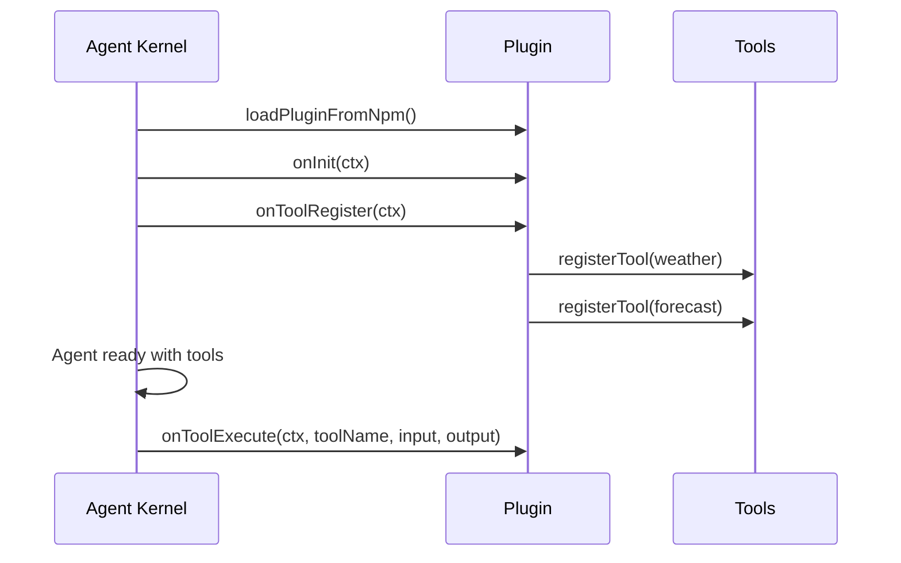

# Plugin Author

> Build, test, and publish a reusable plugin for vinhnt-sdk agents.

---

## Plugin Structure

A plugin is an npm package that exports a plugin definition and manifest.

```
my-plugin/
├── package.json
├── manifest.json
├── src/
│   └── index.ts
├── tsconfig.json
└── README.md
```

## package.json

```json
{
  "name": "@vinhnt-sdk/plugin-weather",
  "version": "1.0.0",
  "type": "module",
  "main": "dist/index.js",
  "types": "dist/index.d.ts",
  "files": ["dist"],
  "scripts": {
    "build": "tsc",
    "test": "vitest run",
    "prepublishOnly": "npm run build"
  },
  "peerDependencies": {
    "@vinhnt-sdk/core": "^0.1.1"
  },
  "devDependencies": {
    "typescript": "^5.5.0",
    "vitest": "^2.0.0"
  }
}
```

## manifest.json

```json
{
  "name": "weather",
  "version": "1.0.0",
  "description": "Weather lookup tools for vinhnt-sdk agents",
  "author": "your-name",
  "hooks": ["onInit", "onToolRegister", "onToolExecute"],
  "tools": ["get_weather", "get_forecast"],
  "config": {
    "apiKey": {
      "type": "string",
      "required": true,
      "description": "OpenWeatherMap API key"
    }
  }
}
```

## Plugin Source (src/index.ts)

```typescript
import { definePlugin, defineTool } from "@vinhnt-sdk/core";
import { z } from "zod";

const WEATHER_API = "https://api.openweathermap.org/data/2.5";

export const plugin = definePlugin({
  name: "weather",
  version: "1.0.0",
  description: "Weather lookup tools",

  hooks: {
    onInit: async (ctx) => {
      console.log(`[weather] Plugin initialized for tenant ${ctx.tenantId}`);
    },

    onToolRegister: async (ctx) => {
      ctx.registerTool(defineTool({
        name: "get_weather",
        description: "Get current weather for a city",
        risk: "low",
        input: z.object({
          city: z.string().describe("City name"),
        }),
        execute: async (input) => {
          const apiKey = ctx.getConfig("apiKey");
          const response = await fetch(
            `${WEATHER_API}/weather?q=${encodeURIComponent(input.city)}&appid=${apiKey}`
          );
          if (!response.ok) return { error: "City not found" };
          const data = await response.json();
          return {
            city: data.name,
            temp: data.main.temp,
            condition: data.weather[0].main,
          };
        },
      }));

      ctx.registerTool(defineTool({
        name: "get_forecast",
        description: "Get 5-day forecast for a city",
        risk: "low",
        input: z.object({ city: z.string() }),
        execute: async (input) => {
          const apiKey = ctx.getConfig("apiKey");
          const response = await fetch(
            `${WEATHER_API}/forecast?q=${encodeURIComponent(input.city)}&appid=${apiKey}`
          );
          const data = await response.json();
          return {
            city: data.city.name,
            forecast: data.list.slice(0, 5).map((item: any) => ({
              time: item.dt_txt,
              temp: item.main.temp,
              condition: item.weather[0].main,
            })),
          };
        },
      }));
    },

    onToolExecute: async (ctx, toolName, input, output) => {
      console.log(`[weather] Tool ${toolName} executed`);
    },
  },
});
```

## Plugin Setup Function

```typescript
import { definePlugin } from "@vinhnt-sdk/core";

export const plugin = definePlugin({
  name: "weather",
  version: "1.0.0",

  setup: async (api) => {
    // Register tools
    api.registerTool(weatherTool);
    api.registerTool(forecastTool);

    // Register hooks
    api.onInit(async (ctx) => {
      console.log("Weather plugin ready");
    });

    api.onToolExecute(async (ctx, toolName, input, output) => {
      // Log or transform results
    });

    // Access plugin config
    const apiKey = api.getConfig("apiKey");
    console.log(`API key configured: ${!!apiKey}`);
  },
});
```

## Testing the Plugin

```typescript
import { describe, it, expect, vi } from "vitest";
import { plugin } from "../src/index";

describe("weather plugin", () => {
  it("registers tools on setup", async () => {
    const registeredTools: string[] = [];
    const mockApi = {
      registerTool: (tool: any) => registeredTools.push(tool.name),
      onInit: vi.fn(),
      onToolExecute: vi.fn(),
      getConfig: vi.fn().mockReturnValue("test-key"),
    };

    await plugin.setup!(mockApi);
    expect(registeredTools).toContain("get_weather");
    expect(registeredTools).toContain("get_forecast");
  });

  it("returns weather data", async () => {
    const mockFetch = vi.fn().mockResolvedValue({
      ok: true,
      json: () => Promise.resolve({
        name: "Hanoi",
        main: { temp: 28 },
        weather: [{ main: "Sunny" }],
      }),
    });
    global.fetch = mockFetch;

    const tool = plugin.hooks.onToolRegister;
    expect(tool).toBeDefined();
  });
});
```

## Publishing to npm

```bash
# Build the plugin
npm run build

# Run tests
npm test

# Login to npm (if needed)
npm login

# Publish with public scope
npm publish --access public
```

## Using the Plugin

```typescript
import { AgentKernel, NullRunEventStore, loadPluginFromNpm } from "@vinhnt-sdk/core";

const model = {
  id: "openai-gpt4o",
  provider: "openai",
  model: "gpt-4o",
  capabilities: { streaming: true, toolCalling: true, vision: false },
  async *stream(request) {
    // Implement with your preferred AI SDK
  },
};

// Load plugin from npm
const weatherPlugin = await loadPluginFromNpm("@vinhnt-sdk/plugin-weather", {
  config: { apiKey: process.env.WEATHER_API_KEY },
});

const kernel = new AgentKernel({
  model,
  plugins: [weatherPlugin],
  store: new NullRunEventStore(),
});

const result = await kernel.run("What's the weather in Hanoi?");
console.log(result);
```

## Plugin Lifecycle


