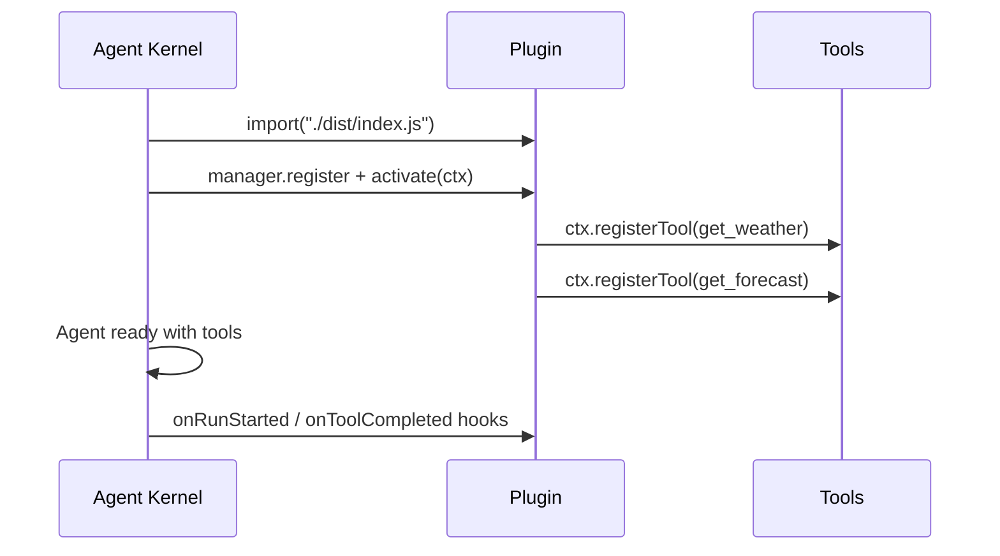

# Plugin Author

> Build, test, and publish a reusable plugin for vinhnt-sdk agents.

---

## Plugin Structure

A plugin is an npm package whose default export is a `Plugin` built with `definePlugin` (manifest + hooks + lifecycle declared in code — there is no separate manifest file).

```
my-plugin/
├── package.json
├── src/
│   └── index.ts
├── tsconfig.json
└── README.md
```

## package.json

```json
{
  "name": "@vinhnt-sdk/plugin-weather",
  "version": "1.0.0",
  "type": "module",
  "main": "dist/index.js",
  "types": "dist/index.d.ts",
  "files": ["dist"],
  "scripts": {
    "build": "tsc",
    "test": "vitest run",
    "prepublishOnly": "npm run build"
  },
  "peerDependencies": {
    "@vinhnt-sdk/core": "^0.10.9",
    "@vinhnt-sdk/plugin": "^0.4.2"
  },
  "devDependencies": {
    "typescript": "^5.5.0",
    "vitest": "^2.0.0"
  }
}
```

## Plugin Source (src/index.ts)

```typescript
import { definePlugin } from "@vinhnt-sdk/plugin";
import { defineTool } from "@vinhnt-sdk/core";
import { z } from "zod";

const WEATHER_API = "https://api.openweathermap.org/data/2.5";

const getWeatherTool = defineTool({
  name: "get_weather",
  description: "Get current weather for a city",
  risk: "external",
  input: z.object({
    city: z.string().describe("City name"),
  }),
  execute: async (input) => {
    const apiKey = process.env.WEATHER_API_KEY;
    const response = await fetch(
      `${WEATHER_API}/weather?q=${encodeURIComponent(input.city)}&appid=${apiKey}`
    );
    if (!response.ok) return { error: "City not found" };
    const data = await response.json();
    return {
      city: data.name,
      temp: data.main.temp,
      condition: data.weather[0].main,
    };
  },
});

const getForecastTool = defineTool({
  name: "get_forecast",
  description: "Get 5-day forecast for a city",
  risk: "external",
  input: z.object({ city: z.string() }),
  execute: async (input) => {
    const apiKey = process.env.WEATHER_API_KEY;
    const response = await fetch(
      `${WEATHER_API}/forecast?q=${encodeURIComponent(input.city)}&appid=${apiKey}`
    );
    const data = await response.json();
    return {
      city: data.city.name,
      forecast: data.list.slice(0, 5).map((item: any) => ({
        time: item.dt_txt,
        temp: item.main.temp,
        condition: item.weather[0].main,
      })),
    };
  },
});

export const plugin = definePlugin(
  {
    id: "weather",
    name: "Weather",
    version: "1.0.0",
    description: "Weather lookup tools",
    metadata: {
      tools: ["get_weather", "get_forecast"],
      configEnv: ["WEATHER_API_KEY"],
    },
  },
  {
    hooks: {
      onRunStarted: async ({ prompt }) => {
        console.log(`[weather] run started: ${prompt.slice(0, 40)}`);
      },
      onToolCompleted: async ({ toolName, output }) => {
        console.log(`[weather] ${toolName} completed`);
      },
    },
    activate: async (ctx) => {
      ctx.registerTool(getWeatherTool);
      ctx.registerTool(getForecastTool);
    },
    deactivate: async () => {
      console.log("[weather] plugin deactivated");
    },
  }
);
```

## Hooks

Observation hooks are read-only; mutation hooks return `{ modified: value }` or `null` to leave the value untouched.

```typescript
import { definePlugin } from "@vinhnt-sdk/plugin";

export const plugin = definePlugin(
  { id: "weather", name: "Weather", version: "1.0.0" },
  {
    hooks: {
      // Observe tool execution (read-only)
      onAfterToolExecution: async ({ toolName, output }) => {
        console.log(`[weather] ${toolName} ->`, output);
      },

      // Mutate the LLM request before the model call
      onBeforeModelCall: async ({ request }) => ({ modified: { request } }),

      // Answer permission prompts from the plugin (or return null to defer)
      onPermissionAsk: async ({ resource, reason }) =>
        resource.startsWith("weather.") ? { modified: { reply: "once" } } : null,
    },
  }
);
```

Available hooks: `onRunStarted`, `onStepStarted`, `onTokenStreamed`, `onToolCompleted`, `onToolFailed`, `onContextCompressed`, `onStepCompleted`, `onStepFailed`, `onRunCompleted`, `onToolInvoked`, `onPermissionAsk`, `onChatParams`, `onShellEnv`, `onBeforeModelCall`, `onAfterModelCall`, `onBeforeToolExecution`, `onAfterToolExecution`.

## Testing the Plugin

```typescript
import { describe, it, expect } from "vitest";
import type { PluginContext } from "@vinhnt-sdk/core";
import { plugin } from "../src/index";

describe("weather plugin", () => {
  it("registers tools on activate", async () => {
    const registered: string[] = [];
    const ctx = {
      registerTool: (tool: { name: string }) => {
        registered.push(tool.name);
        return { dispose: async () => {} };
      },
    } as unknown as PluginContext;

    await plugin.activate(ctx);
    expect(registered).toContain("get_weather");
    expect(registered).toContain("get_forecast");
  });

  it("exposes its manifest", () => {
    expect(plugin.manifest.id).toBe("weather");
    expect(plugin.manifest.version).toBe("1.0.0");
  });
});
```

## Publishing to npm

```bash
# Build the plugin
npm run build

# Run tests
npm test

# Login to npm (if needed)
npm login

# Publish with public scope
npm publish --access public
```

## Using the Plugin

```typescript
import {
  AgentKernel,
  DefaultPluginManager,
  InMemoryAgentRegistry,
  InMemoryEventBus,
  createToolProviderRegistry,
} from "@vinhnt-sdk/core";
import { NullRunEventStore } from "@vinhnt-sdk/session";
import weatherPlugin from "./dist/index.js";

const model = {
  provider: "openai",
  model: "gpt-4o",
  contextLimit: 128_000,
  capabilities: {
    streaming: true,
    toolCalling: true,
    imageInput: false,
    thinking: false,
    structuredOutput: true,
  },
  async generate(request) {
    // Implement with your preferred AI SDK
    throw new Error("implement me");
  },
};

const toolProviderRegistry = await createToolProviderRegistry({
  workspaceRoot: process.cwd(),
  shell: { workspaceRoot: process.cwd(), defaultTimeoutMs: 30_000 },
});

const manager = new DefaultPluginManager({
  agentRegistry: new InMemoryAgentRegistry(),
  toolProviderRegistry,
  eventBus: new InMemoryEventBus(),
});

// Register the plugin you just built
await manager.register(weatherPlugin);
await manager.activate(weatherPlugin.manifest.id);

const kernel = new AgentKernel({
  model,
  store: new NullRunEventStore(),
  pluginManager: manager,
});

const handle = kernel.run("What's the weather in Hanoi?", {
  requestId: "req-1",
  traceId: "trace-1",
  actorId: "user-1",
  tenantId: "tenant-1",
});
await handle.completed;
```

## Plugin Lifecycle


```mermaid
sequenceDiagram
    participant A as Agent Kernel
    participant P as Plugin
    participant T as Tools

    A->>P: import("./dist/index.js")
    A->>P: manager.register + activate(ctx)
    P->>T: ctx.registerTool(get_weather)
    P->>T: ctx.registerTool(get_forecast)
    A->>A: Agent ready with tools
    A->>P: onRunStarted / onToolCompleted hooks
```
