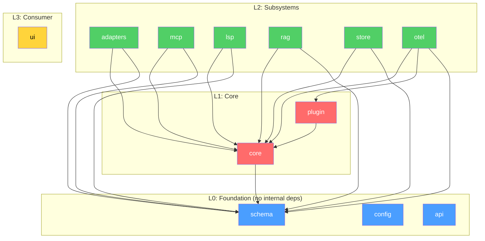
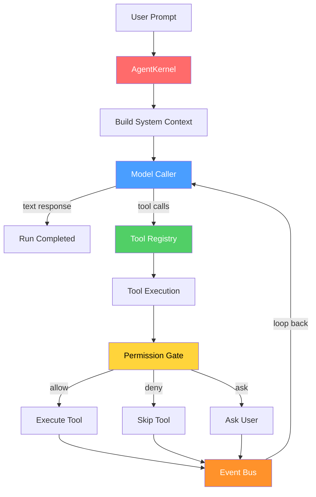
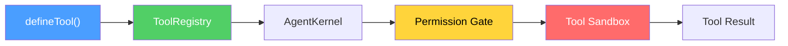
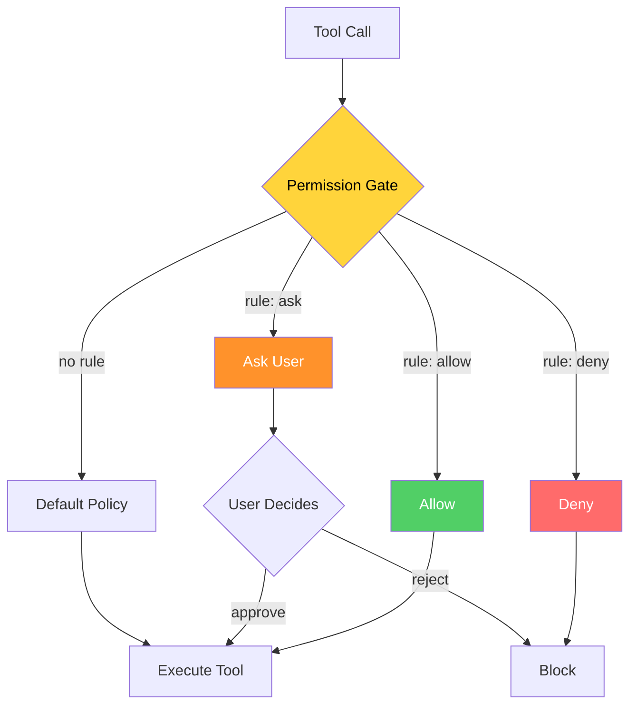
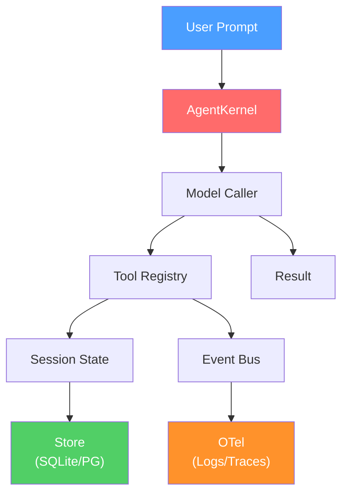

# Architecture

> System design, dependency graph, and layer model of vinhnt-sdk.

---

## Design Principles

### 1. Modularity

Each package is independently publishable and can be used in isolation. You can use `@vinhnt-sdk/core` without `@vinhnt-sdk/store`, or `@vinhnt-sdk/schema` without anything else.

### 2. Separation of Concerns

| Layer | Responsibility |
|-------|---------------|
| **Foundation** | Types, schemas, config, contracts |
| **Core** | Agent runtime, tool system, sessions |
| **Subsystem** | Persistence, observability, model providers |
| **Integration** | MCP, LSP, API, UI |

### 3. Convention over Configuration

- Tool discovery: `.vnt/tools/`
- Skill discovery: `.vnt/skills/`, `.claude/skills/`, `.agents/skills/`
- Agent discovery: `.vnt/agents/`
- Config: `vnt.config.json` or `.vnt/config.json`

### 4. Dependency Injection

The kernel accepts interfaces, not implementations. Swap `NullRunEventStore` for `DrizzleRunEventStore` without changing business logic.

---

## Package Dependency Graph



---

## Core Architecture

### The Kernel

The `AgentKernel` is the central runtime. It orchestrates the entire agent loop:



**Run Loop:**
1. Receive prompt
2. Build system context (agent config, skills, memory)
3. Call model with messages + tool definitions
4. If model returns tool calls → execute tools → loop back to step 3
5. If model returns text → emit completion event
6. Check termination conditions (max steps, doom detection, etc.)

### Tool System

Tools are the primary extension point:



Each tool has:
- **Name** — Unique identifier
- **Description** — What the tool does (used by LLM for selection)
- **Input Schema** — Zod schema for input validation
- **Risk Level** — `low`, `medium`, `high` (gates permission checks)
- **Execute** — The actual implementation

### Permission System



Rules use glob patterns:
```jsonc
{
  "rules": [
    { "pattern": "read_*", "effect": "allow" },
    { "pattern": "write_*", "effect": "ask" },
    { "pattern": "delete_*", "effect": "deny" }
  ]
}
```

### Event System

The kernel emits typed events throughout the run lifecycle:

| Event | When |
|-------|------|
| `run.started` | Run begins |
| `step.started` | Each step begins |
| `tool.invoked` | Tool call starts |
| `tool.completed` | Tool call succeeds |
| `tool.failed` | Tool call fails |
| `token.streamed` | Streaming token received |
| `step.completed` | Step finishes |
| `run.completed` | Run finishes |
| `permission.requested` | User approval needed |
| `context.compressed` | Context window compacted |

---

## Data Flow



---

## Conventions

### File Structure

```
project/
├── .vnt/
│   ├── config.json          # Agent configuration
│   ├── tools/               # Custom tools (auto-discovered)
│   │   └── my-tool.ts
│   ├── skills/              # Skill definitions
│   │   └── coding.yaml
│   └── agents/              # Agent definitions
│       └── assistant.yaml
├── vnt.config.json          # Alternative config location
└── package.json
```

### Tool Naming

- Use `snake_case` for tool names
- Prefix with domain: `file_read`, `git_commit`, `web_fetch`
- Use wildcards in permissions: `file_*`, `git_*`
