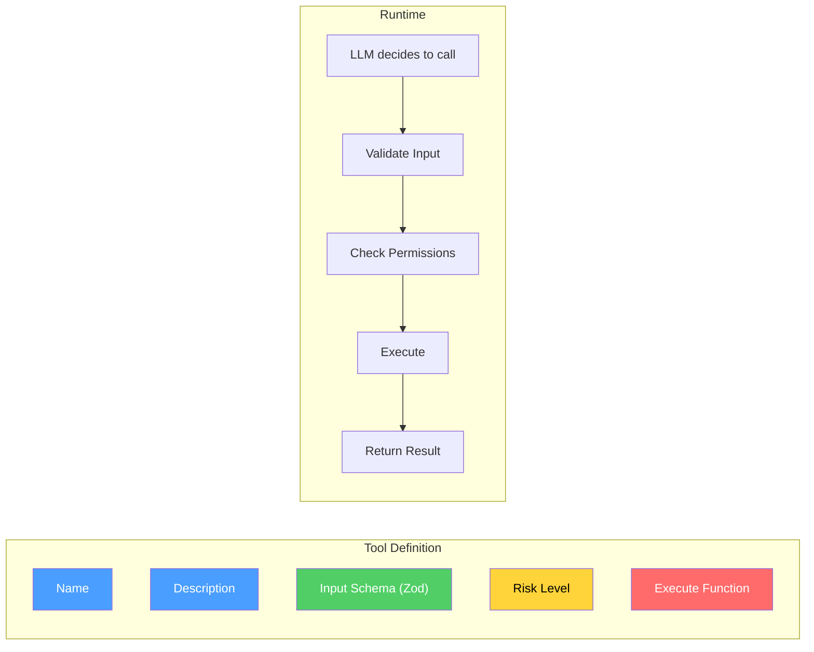

# Creating Tools

> How to define, register, and use custom tools.

---

## What is a Tool?

A tool is a function that the agent can call to interact with the outside world.



## Basic Tool

```typescript
import { defineTool } from "@vinhnt-sdk/core";
import { z } from "zod";

const getWeatherTool = defineTool({
  name: "get_weather",
  description: "Get current weather for a city",
  risk: "low",
  input: z.object({
    city: z.string().describe("City name, e.g. 'Hanoi'"),
  }),
  execute: async (input, context) => {
    const response = await fetch(
      `https://api.weather.example/v1/${input.city}`
    );
    const data = await response.json();
    return {
      temperature: data.temp,
      condition: data.condition,
    };
  },
});
```

## Risk Levels

| Risk | Description | Permission Check |
|------|-------------|-----------------|
| `low` | Read-only, no side effects | Auto-allowed |
| `medium` | May modify state | Checks rules, may ask user |
| `high` | Destructive, irreversible | Always asks user |

## Tool Context

The `execute` function receives a context object:

```typescript
execute: async (input, context) => {
  context.session    // Current session ID
  context.agent      // Current agent config
  context.permissions // Permission checker
  context.trace      // Trace context for distributed tracing
  // ...
}
```

## Advanced Patterns

### Tool with External API

```typescript
const slackTool = defineTool({
  name: "send_slack_message",
  description: "Send a message to a Slack channel",
  risk: "medium",
  input: z.object({
    channel: z.string(),
    message: z.string(),
  }),
  execute: async (input) => {
    const response = await fetch("https://slack.com/api/chat.postMessage", {
      method: "POST",
      headers: {
        "Authorization": `Bearer ${process.env.SLACK_TOKEN}`,
        "Content-Type": "application/json",
      },
      body: JSON.stringify({
        channel: input.channel,
        text: input.message,
      }),
    });
    return await response.json();
  },
});
```

### Tool with Validation

```typescript
const createUserTool = defineTool({
  name: "create_user",
  description: "Create a new user account",
  risk: "high",
  input: z.object({
    email: z.string().email(),
    name: z.string().min(2).max(100),
    role: z.enum(["admin", "user", "viewer"]),
  }),
  execute: async (input) => {
    // Input is fully validated at this point
    const user = await db.users.create(input);
    return { userId: user.id };
  },
});
```

## Registering Tools

### At Kernel Creation

```typescript
const kernel = new AgentKernel({
  model,
  tools: [getWeatherTool, slackTool],
});
```

### Dynamic Registration

```typescript
kernel.tools.register(myTool);
kernel.tools.unregister("my_tool");
```

## Built-in Tools

| Tool | Risk | Description |
|------|------|-------------|
| `createReadFileTool` | low | Read file contents |
| `createWriteFileTool` | high | Write file contents |
| `createEditFileTool` | medium | Edit file with search/replace |
| `createShellTool` | high | Execute shell command |
| `createGlobFilesTool` | low | Find files by pattern |
| `createGrepFilesTool` | low | Search file contents |
| `createWebFetchTool` | low | Fetch URL content |
| `createWebSearchTool` | low | Web search |
| `createQuestionTool` | low | Ask user a question |
| `createGitStatusTool` | low | Git status |
| `createGitDiffTool` | low | Git diff |
| `createGitCommitTool` | high | Git commit |

## Testing Tools

```typescript
import { FakeToolContext } from "@vinhnt-sdk/core/fakes";

const context = new FakeToolContext();
const result = await myTool.execute(
  { city: "Hanoi" },
  context
);

expect(result.temperature).toBeDefined();
```
