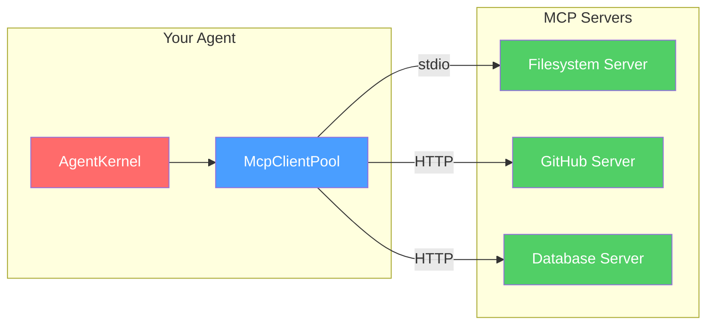
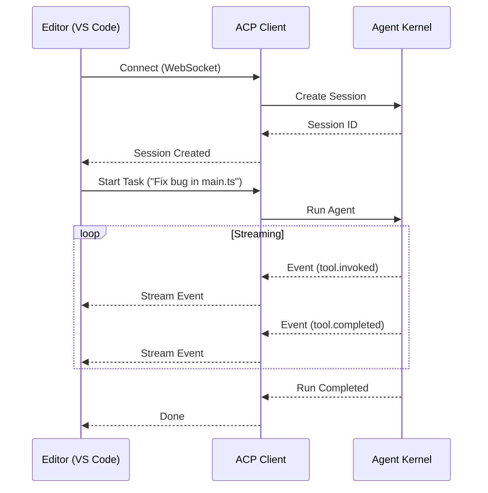

# MCP Integration

> Connecting to MCP (Model Context Protocol) tool servers.

---

## What is MCP?

MCP (Model Context Protocol) is a standardized protocol for connecting AI agents to external tool servers.



## Configuration

Create an `mcp-servers.json` file:

```json
{
  "servers": [
    {
      "name": "filesystem",
      "transport": "stdio",
      "command": "npx",
      "args": ["-y", "@modelcontextprotocol/server-filesystem", "/path/to/files"]
    },
    {
      "name": "github",
      "transport": "http",
      "url": "https://mcp-github.example.com",
      "headers": {
        "Authorization": "Bearer ${GITHUB_TOKEN}"
      }
    }
  ]
}
```

## Connecting to MCP Servers

```typescript
import { McpClientPool, loadMcpConfig } from "@vinhnt-sdk/mcp";

const config = loadMcpConfig("./mcp-servers.json");
const pool = new McpClientPool(config);

// Connect to all servers
await pool.connectAll();

// Get available tools
const tools = pool.getTools();
console.log(tools.map(t => t.name));
// ["filesystem.read_file", "github.search_repositories", ...]
```

## Using MCP Tools

```typescript
import { AgentKernel } from "@vinhnt-sdk/core";

const kernel = new AgentKernel({
  model,
  tools: [...customTools, ...tools], // MCP tools + custom tools
});
```

## Individual Client

```typescript
import { McpClient } from "@vinhnt-sdk/mcp";

const client = new McpClient({
  name: "my-server",
  transport: "stdio",
  command: "npx",
  args: ["-y", "@modelcontextprotocol/server-filesystem", "/tmp"],
});

await client.connect();

const tools = await client.listTools();
const result = await client.callTool("read_file", { path: "/tmp/test.txt" });

await client.disconnect();
```

## ACP (Agent Communication Protocol)

For editor integration (VS Code, etc.):



```typescript
import { AcpClient } from "@vinhnt-sdk/mcp/acp";

const acp = new AcpClient({ url: "ws://localhost:3000/acp" });
await acp.connect();

const session = await acp.createSession({ agentId: "coding-assistant" });
const task = await acp.startTask({
  sessionId: session.id,
  prompt: "Fix the bug in main.ts",
});

acp.on("task.stream", (notification) => {
  console.log(notification.data);
});
```
