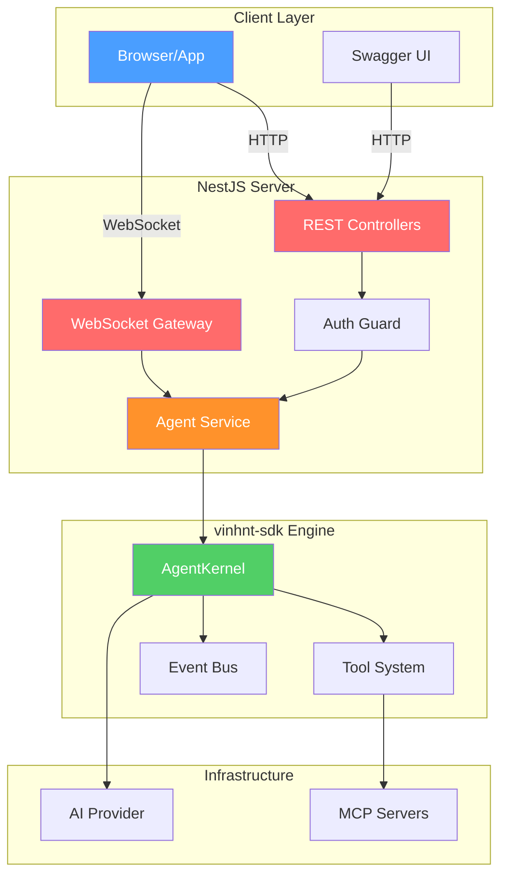

# NestJS Integration

> Building a NestJS backend API with vinhnt-sdk.

---

## Overview

vinhnt-sdk provides the **engine** (types, logic, runtime). You need to build the **server layer** (HTTP, WebSocket, auth) yourself. NestJS is an excellent choice for this.



---

## Setup

### 1. Install Dependencies

```bash
# NestJS core
npm install @nestjs/common @nestjs/core @nestjs/platform-express rxjs reflect-metadata

# vinhnt-sdk
npm install @vinhnt-sdk/core @vinhnt-sdk/schema

# AI SDK
npm install ai @ai-sdk/openai

# Swagger
npm install @nestjs/swagger

# Validation
npm install class-validator class-transformer
```

### 2. Project Structure

```
src/
├── main.ts
├── app.module.ts
├── agent/
│   ├── agent.module.ts
│   ├── agent.service.ts
│   ├── agent.controller.ts
│   ├── agent.gateway.ts          # WebSocket
│   └── dto/
│       ├── run-request.dto.ts
│       ├── run-response.dto.ts
│       └── session-response.dto.ts
├── common/
│   ├── guards/
│   │   └── api-key.guard.ts
│   ├── interceptors/
│   │   └── transform.interceptor.ts
│   └── decorators/
│       └── api-data-response.decorator.ts
└── config/
    └── agent.config.ts
```

---

## Implementation

### Agent Service (wraps vinhnt-sdk)

```typescript
// src/agent/agent.service.ts
import { Injectable, OnModuleInit } from "@nestjs/common";
import {
  AgentKernel,
  NullRunEventStore,
  defineTool,
} from "@vinhnt-sdk/core";
import { z } from "zod";

@Injectable()
export class AgentService implements OnModuleInit {
  private kernel!: AgentKernel;

  async onModuleInit() {
    // 1. Create model provider (implement ModelProvider interface)
    const model = {
      id: "openai-gpt4o",
      provider: "openai",
      model: "gpt-4o",
      capabilities: { streaming: true, toolCalling: true, vision: false },
      async *stream(request: any) {
        // Implement with your preferred AI SDK
      },
    };

    // 2. Register tools
    const tools = this.createTools();

    // 3. Create kernel
    this.kernel = new AgentKernel({
      model,
      tools,
      store: new NullRunEventStore(),
    });
  }

  private createTools() {
    return [
      defineTool({
        name: "get_weather",
        description: "Get weather for a city",
        risk: "low",
        input: z.object({ city: z.string() }),
        execute: async (input) => {
          // Call external API
          return { temp: 28, condition: "sunny" };
        },
      }),
      // Add more tools...
    ];
  }

  async run(prompt: string, sessionId?: string) {
    const handle = this.kernel.run(prompt, { sessionId });
    const result = await handle.completed;
    return result;
  }

  async *stream(prompt: string, sessionId?: string) {
    const handle = this.kernel.run(prompt, { sessionId });
    for await (const event of handle.events) {
      yield event;
    }
  }
}
```

### REST Controller

```typescript
// src/agent/agent.controller.ts
import { Controller, Post, Body, Get, Param, Sse } from "@nestjs/common";
import { ApiTags, ApiOperation, ApiBearerAuth } from "@nestjs/swagger";
import { Observable } from "rxjs";
import { AgentService } from "./agent.service";
import { RunRequestDto } from "./dto/run-request.dto";
import { ApiDataResponse } from "../common/decorators/api-data-response.decorator";

@ApiTags("Agent")
@ApiBearerAuth()
@Controller("agent")
export class AgentController {
  constructor(private readonly agentService: AgentService) {}

  @Post("run")
  @ApiOperation({ summary: "Run agent with prompt" })
  @ApiDataResponse(String)
  async run(@Body() dto: RunRequestDto) {
    const result = await this.agentService.run(dto.prompt, dto.sessionId);
    return result;
  }

  @Sse("stream")
  @ApiOperation({ summary: "Stream agent events via SSE" })
  stream(@Body() dto: RunRequestDto): Observable<any> {
    return new Observable((subscriber) => {
      this.agentService
        .stream(dto.prompt, dto.sessionId)
        .then(async (generator) => {
          for await (const event of generator) {
            subscriber.next(event);
          }
          subscriber.complete();
        })
        .catch((err) => subscriber.error(err));
    });
  }
}
```

### WebSocket Gateway

```typescript
// src/agent/agent.gateway.ts
import {
  WebSocketGateway,
  WebSocketServer,
  SubscribeMessage,
  OnGatewayConnection,
  OnGatewayDisconnect,
  ConnectedSocket,
  MessageBody,
} from "@nestjs/websockets";
import { Server, Socket } from "socket.io";
import { AgentService } from "./agent.service";

@WebSocketGateway({ cors: true })
export class AgentGateway
  implements OnGatewayConnection, OnGatewayDisconnect
{
  @WebSocketServer()
  server!: Server;

  constructor(private readonly agentService: AgentService) {}

  handleConnection(client: Socket) {
    console.log(`Client connected: ${client.id}`);
  }

  handleDisconnect(client: Socket) {
    console.log(`Client disconnected: ${client.id}`);
  }

  @SubscribeMessage("agent:run")
  async handleRun(
    @ConnectedSocket() client: Socket,
    @MessageBody() data: { prompt: string; sessionId?: string }
  ) {
    try {
      for await (const event of this.agentService.stream(
        data.prompt,
        data.sessionId
      )) {
        client.emit("agent:event", event);
      }
      client.emit("agent:done", { success: true });
    } catch (error) {
      client.emit("agent:error", { error: error.message });
    }
  }

  @SubscribeMessage("agent:stop")
  handleStop(@ConnectedSocket() client: Socket) {
    // Abort running agent
    client.emit("agent:stopped", { success: true });
  }
}
```

### Auth Guard

```typescript
// src/common/guards/api-key.guard.ts
import { Injectable, CanActivate, ExecutionContext } from "@nestjs/common";
import { ConfigService } from "@nestjs/config";

@Injectable()
export class ApiKeyGuard implements CanActivate {
  constructor(private config: ConfigService) {}

  canActivate(context: ExecutionContext): boolean {
    const request = context.switchToHttp().getRequest();
    const token = request.headers.authorization?.replace("Bearer ", "");

    const expectedToken = this.config.get("API_TOKEN");
    return token === expectedToken;
  }
}
```

### DTOs

```typescript
// src/agent/dto/run-request.dto.ts
import { IsString, IsOptional, MinLength, MaxLength } from "class-validator";
import { ApiProperty, ApiPropertyOptional } from "@nestjs/swagger";

export class RunRequestDto {
  @ApiProperty({ example: "What is the weather in Hanoi?" })
  @IsString()
  @MinLength(1)
  @MaxLength(10000)
  prompt!: string;

  @ApiPropertyOptional()
  @IsString()
  @IsOptional()
  sessionId?: string;
}
```

### Main Bootstrap

```typescript
// src/main.ts
import { NestFactory } from "@nestjs/core";
import { ValidationPipe } from "@nestjs/common";
import { SwaggerModule, DocumentBuilder } from "@nestjs/swagger";
import { AppModule } from "./app.module";

async function bootstrap() {
  const app = await NestFactory.create(AppModule);

  // Global prefix
  app.setGlobalPrefix("api/v1");

  // Validation
  app.useGlobalPipes(new ValidationPipe({ transform: true }));

  // CORS
  app.enableCors();

  // Swagger
  const config = new DocumentBuilder()
    .setTitle("Agent API")
    .setDescription("AI Agent Backend API")
    .setVersion("1.0")
    .addBearerAuth()
    .build();

  const document = SwaggerModule.createDocument(app, config);
  SwaggerModule.setup("api-doc", app, document);

  await app.listen(3000);
  console.log("Server running on http://localhost:3000");
  console.log("Swagger docs at http://localhost:3000/api-doc");
}

bootstrap();
```

---

## API Endpoints

| Method | Path | Description |
|--------|------|-------------|
| `POST` | `/api/v1/agent/run` | Run agent synchronously |
| `SSE` | `/api/v1/agent/stream` | Stream agent events |
| `GET` | `/api/v1/sessions` | List sessions |
| `GET` | `/api/v1/sessions/:id` | Get session details |
| `GET` | `/api/v1/runs` | List runs |
| `GET` | `/api/v1/runs/:id` | Get run details |
| `GET` | `/api/v1/agents` | List available agents |
| `POST` | `/api/v1/tools/execute` | Execute a tool directly |

## WebSocket Events

| Event | Direction | Payload |
|-------|-----------|---------|
| `agent:run` | Client → Server | `{ prompt, sessionId? }` |
| `agent:event` | Server → Client | Run event object |
| `agent:done` | Server → Client | `{ success: true }` |
| `agent:error` | Server → Client | `{ error: string }` |
| `agent:stop` | Client → Server | — |

---

## Key Mapping: vinhnt-sdk → NestJS

| vinhnt-sdk Concept | NestJS Implementation |
|--------------------|-----------------------|
| `AgentKernel` | `AgentService` (wraps kernel) |
| `defineTool()` | Tool definitions in service |
| `RunEvent` | SSE / WebSocket events |
| `SessionStore` | REST endpoints |
| `PermissionGate` | Auth guard + permission logic |
| `PluginManager` | Service initialization |
| `EventBus` | WebSocket gateway broadcast |
