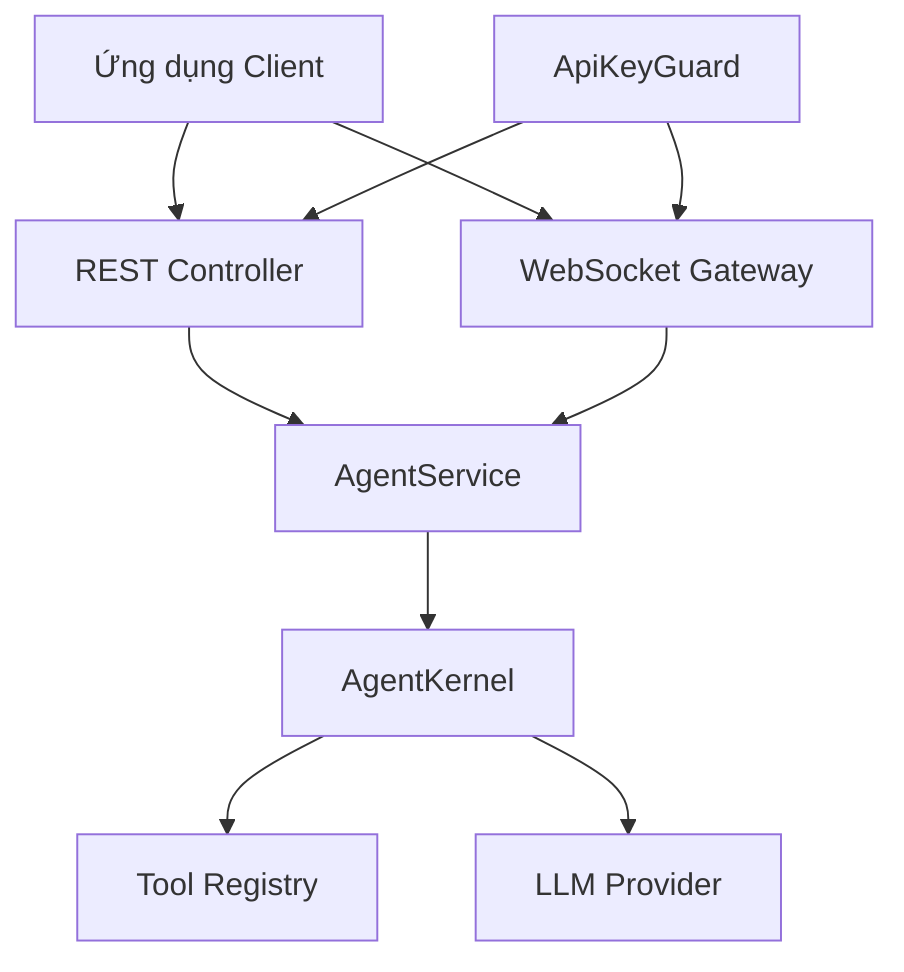

# Tích hợp NestJS

Xây dựng backend AI agent sẵn sàng cho sản phẩm sử dụng NestJS với vinhnt-sdk.

## Kiến trúc



## Cài đặt

```bash
npm install @nestjs/common @nestjs/core @nestjs/platform-express
npm install @nestjs/websockets @nestjs/platform-socket.io
npm install @nestjs/swagger class-validator class-transformer
npm install vinhnt-sdk
```

## Cấu trúc dự án

```
src/
├── app.module.ts
├── main.ts
├── agent/
│   ├── agent.module.ts
│   ├── agent.service.ts
│   ├── agent.controller.ts
│   ├── agent.gateway.ts
│   ├── dto/
│   │   ├── invoke.dto.ts
│   │   └── chat.dto.ts
│   └── guards/
│       └── api-key.guard.ts
```

## AgentService

```typescript
import { Injectable, OnModuleInit, OnModuleDestroy } from '@nestjs/common';
import { AgentKernel, Tool } from 'vinhnt-sdk';

@Injectable()
export class AgentService implements OnModuleInit, OnModuleDestroy {
  private kernel: AgentKernel;

  async onModuleInit() {
    this.kernel = new AgentKernel({
      model: process.env.LLM_MODEL || 'gpt-4',
      apiKey: process.env.LLM_API_KEY,
      systemPrompt: 'Bạn là trợ lý AI hữu ích.'
    });
  }

  async onModuleDestroy() {
    await this.kernel.destroy();
  }

  async invoke(prompt: string, context?: Record<string, any>) {
    return this.kernel.invoke(prompt, context);
  }

  async *stream(prompt: string, context?: Record<string, any>) {
    yield* this.kernel.stream(prompt, context);
  }

  registerTool(tool: Tool) {
    this.kernel.registerTool(tool);
  }
}
```

## REST Controller với SSE

```typescript
import { Controller, Post, Body, Sse, MessageEvent, Param, Get, HttpCode, HttpStatus } from '@nestjs/common';
import { ApiTags, ApiOperation } from '@nestjs/swagger';
import { AgentService } from './agent.service';
import { InvokeDto, ChatDto } from './dto';
import { Observable, Subject } from 'rxjs';

@ApiTags('Agent')
@Controller('agent')
export class AgentController {
  constructor(private readonly agentService: AgentService) {}

  @Post('invoke')
  @HttpCode(HttpStatus.OK)
  @ApiOperation({ summary: 'Gọi agent với prompt' })
  async invoke(@Body() dto: InvokeDto) {
    const result = await this.agentService.invoke(dto.prompt, dto.context);
    return { result };
  }

  @Sse('stream/:conversationId')
  @ApiOperation({ summary: 'Streaming phản hồi agent' })
  stream(@Param('conversationId') id: string, @Body() dto: ChatDto): Observable<MessageEvent> {
    const subject = new Subject<MessageEvent>();
    (async () => {
      try {
        for await (const chunk of this.agentService.stream(dto.prompt, { conversationId: id })) {
          subject.next({ data: chunk, type: 'message' });
        }
        subject.complete();
      } catch (error) {
        subject.error(error);
      }
    })();
    return subject.asObservable();
  }

  @Get('health')
  health() {
    return { status: 'ok', timestamp: new Date().toISOString() };
  }
}
```

## WebSocket Gateway

```typescript
import { WebSocketGateway, WebSocketServer, SubscribeMessage, MessageBody, ConnectedSocket } from '@nestjs/websockets';
import { Server, Socket } from 'socket.io';
import { AgentService } from './agent.service';

@WebSocketGateway({ cors: { origin: '*' }, namespace: '/agent' })
export class AgentGateway {
  @WebSocketServer()
  server: Server;

  constructor(private readonly agentService: AgentService) {}

  @SubscribeMessage('invoke')
  async handleInvoke(@ConnectedSocket() client: Socket, @MessageBody() data: { prompt: string }) {
    try {
      const result = await this.agentService.invoke(data.prompt);
      client.emit('invoke:result', { success: true, data: result });
    } catch (error) {
      client.emit('invoke:error', { success: false, error: error.message });
    }
  }

  @SubscribeMessage('stream')
  async handleStream(@ConnectedSocket() client: Socket, @MessageBody() data: { prompt: string; conversationId?: string }) {
    try {
      for await (const chunk of this.agentService.stream(data.prompt, { conversationId: data.conversationId })) {
        client.emit('stream:chunk', { data: chunk });
      }
      client.emit('stream:complete', { success: true });
    } catch (error) {
      client.emit('stream:error', { success: false, error: error.message });
    }
  }

  @SubscribeMessage('ping')
  handlePing(@ConnectedSocket() client: Socket) {
    client.emit('pong', { timestamp: Date.now() });
  }
}
```

## ApiKeyGuard

```typescript
import { Injectable, CanActivate, ExecutionContext, UnauthorizedException } from '@nestjs/common';
import { ConfigService } from '@nestjs/config';

@Injectable()
export class ApiKeyGuard implements CanActivate {
  constructor(private configService: ConfigService) {}

  canActivate(context: ExecutionContext): boolean {
    const request = context.switchToHttp().getRequest();
    const apiKey = request.headers['x-api-key'];
    if (apiKey !== this.configService.get<string>('API_KEY')) {
      throw new UnauthorizedException('API key không hợp lệ');
    }
    return true;
  }
}
```

## DTOs

```typescript
import { IsString, IsOptional, IsObject, MinLength, MaxLength } from 'class-validator';
import { ApiProperty, ApiPropertyOptional } from '@nestjs/swagger';

export class InvokeDto {
  @ApiProperty({ example: 'Thủ đô của Pháp là gì?' })
  @IsString() @MinLength(1) @MaxLength(10000)
  prompt: string;

  @ApiPropertyOptional()
  @IsOptional() @IsObject()
  context?: Record<string, any>;
}

export class ChatDto {
  @ApiProperty({ example: 'Kể cho tôi một câu chuyện cười' })
  @IsString() @MinLength(1) @MaxLength(10000)
  prompt: string;

  @ApiPropertyOptional()
  @IsOptional() @IsString()
  conversationId?: string;
}
```

## Khởi tạo Swagger

```typescript
import { NestFactory } from '@nestjs/core';
import { ValidationPipe } from '@nestjs/common';
import { SwaggerModule, DocumentBuilder } from '@nestjs/swagger';
import { AppModule } from './app.module';

async function bootstrap() {
  const app = await NestFactory.create(AppModule);
  app.useGlobalPipes(new ValidationPipe({ whitelist: true, transform: true }));

  const config = new DocumentBuilder()
    .setTitle('vinhnt-sdk Agent API')
    .setDescription('Backend AI Agent sử dụng vinhnt-sdk')
    .setVersion('1.0')
    .addBearerAuth()
    .addApiKey({ type: 'apiKey', name: 'X-API-Key', in: 'header' }, 'api-key')
    .build();

  SwaggerModule.setup('api', app, SwaggerModule.createDocument(app, config));
  await app.listen(3000);
}
bootstrap();
```

## API Endpoints

| Phương thức | Endpoint | Mô tả |
|-------------|----------|-------|
| POST | `/agent/invoke` | Gửi prompt, nhận phản hồi đầy đủ |
| SSE | `/agent/stream/:conversationId` | Streaming các chunk phản hồi |
| GET | `/agent/health` | Kiểm tra sức khỏe endpoint |

## WebSocket Events

| Event | Chiều | Mô tả |
|-------|-------|-------|
| `invoke` | Client → Server | Gửi prompt để xử lý |
| `invoke:result` | Server → Client | Kết quả phản hồi đầy đủ |
| `invoke:error` | Server → Client | Phản hồi lỗi |
| `stream` | Client → Server | Bắt đầu yêu cầu streaming |
| `stream:chunk` | Server → Client | Chunk phản hồi riêng lẻ |
| `stream:complete` | Server → Client | Stream đã hoàn thành |
| `stream:error` | Server → Client | Lỗi stream |
| `ping` | Client → Server | Giữ kết nối alive |
| `pong` | Server → Client | Phản hồi giữ kếtoneksi