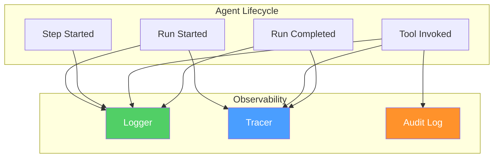

# Observability

> Logging, tracing, and auditing for agent systems.

---

## Overview

vinhnt-sdk provides **observability hooks** through the plugin system. You can implement your own observability layer using your preferred tools.



## Using Run Events

vinhnt-sdk emits events during agent execution. You can listen to these events for logging and tracing:

```typescript
const handle = kernel.run(prompt);

for await (const event of handle.events) {
  switch (event.type) {
    case "run.started":
      console.log(`Run started: ${event.data.runId}`);
      break;
    case "tool.invoked":
      console.log(`Tool invoked: ${event.data.toolName}`);
      break;
    case "tool.completed":
      console.log(`Tool completed: ${event.data.toolName}`);
      break;
    case "token.streamed":
      console.log(`Tokens: ${event.data.tokenCount}`);
      break;
    case "run.completed":
      console.log(`Run completed in ${event.data.totalDuration}ms`);
      break;
  }
}
```

## Custom Logger

```typescript
class Logger {
  private level: "debug" | "info" | "warn" | "error";

  constructor(options: { level: string }) {
    this.level = options.level as any;
  }

  info(message: string, data?: any) {
    if (this.level === "info" || this.level === "debug") {
      console.log(`[INFO] ${message}`, data);
    }
  }

  warn(message: string, data?: any) {
    if (this.level !== "debug") {
      console.warn(`[WARN] ${message}`, data);
    }
  }

  error(message: string, data?: any) {
    console.error(`[ERROR] ${message}`, data);
  }
}
```

## Custom Tracer

```typescript
class Tracer {
  private spans: Map<string, { start: number; attributes: any }> = new Map();

  startSpan(name: string, options?: { attributes?: any }) {
    const spanId = crypto.randomUUID();
    this.spans.set(spanId, {
      start: Date.now(),
      attributes: options?.attributes,
    });
    return {
      spanId,
      setStatus: (status: { code: string; message?: string }) => {},
      end: () => {
        const span = this.spans.get(spanId);
        if (span) {
          const duration = Date.now() - span.start;
          console.log(`[TRACE] ${name}: ${duration}ms`, span.attributes);
          this.spans.delete(spanId);
        }
      },
    };
  }
}
```

## Audit Logging

```typescript
class AuditLog {
  private logs: any[] = [];

  async log(entry: {
    action: string;
    actor: string;
    resource: string;
    details: any;
    outcome: string;
  }) {
    this.logs.push({
      ...entry,
      timestamp: new Date().toISOString(),
    });
    console.log(`[AUDIT] ${entry.action} by ${entry.actor}: ${entry.outcome}`);
  }
}
```

## OpenTelemetry Integration

For production observability, integrate with OpenTelemetry:

```typescript
import { NodeSDK } from "@opentelemetry/sdk-node";
import { ConsoleSpanExporter } from "@opentelemetry/sdk-trace-node";

const sdk = new NodeSDK({
  serviceName: "vinhnt-agent",
  traceExporter: new ConsoleSpanExporter(),
});

sdk.start();
```

## What Gets Tracked

| Event | Data |
|-------|------|
| `run.started` | runId, agentId, prompt |
| `step.started` | stepNumber, stepType |
| `tool.invoked` | toolName, input |
| `tool.completed` | toolName, result, duration |
| `tool.failed` | toolName, error, duration |
| `token.streamed` | tokenCount, model |
| `run.completed` | totalDuration, totalTokens |
| `context.compressed` | originalTokens, compressedTokens |
