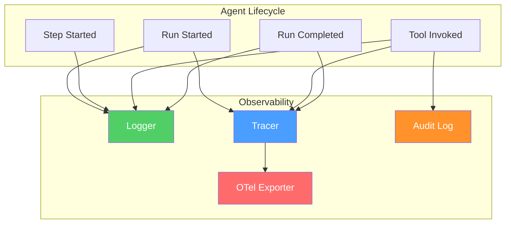

# Observability

> Logging, tracing, and auditing for agent systems.

---

## Overview



## Quick Setup

```typescript
import { createObservabilityPlugin } from "@vinhnt-sdk/otel";

const plugin = createObservabilityPlugin({
  logLevel: "info",
  auditEnabled: true,
});

pluginManager.register(plugin);
```

## Logging

```typescript
import { Logger, ConsoleSink, FileSink } from "@vinhnt-sdk/otel";

const logger = new Logger({
  level: "info",
  sinks: [
    new ConsoleSink({ colorize: true }),
    new FileSink({ path: "./logs/agent.log", maxSize: "10MB" }),
  ],
});

logger.info("Agent started", { agentId: "coding-assistant" });
logger.warn("Context approaching limit", { tokens: 120000 });
logger.error("Tool failed", { tool: "execute_command", error });
```

## Distributed Tracing

```typescript
import { Tracer } from "@vinhnt-sdk/otel";

const tracer = new Tracer();

const span = tracer.startSpan("agent.run", {
  attributes: { "agent.id": "coding-assistant" },
});

try {
  const result = await agent.run(prompt);
  span.setStatus({ code: "OK" });
} catch (error) {
  span.setStatus({ code: "ERROR", message: error.message });
} finally {
  span.end();
}
```

## Audit Logging

```typescript
import { AuditLog } from "@vinhnt-sdk/otel";

const audit = new AuditLog({
  sink: new FileSink({ path: "./audit.log" }),
});

await audit.log({
  action: "tool.execute",
  actor: "user-123",
  resource: "execute_command",
  details: { command: "rm -rf /" },
  outcome: "denied",
});
```

## OpenTelemetry Integration

```typescript
import { OTelTracerSink } from "@vinhnt-sdk/otel";

const tracer = new Tracer({
  sinks: [
    new OTelTracerSink({
      endpoint: "http://localhost:4318",
      serviceName: "vinhnt-agent",
    }),
  ],
});
```

## What Gets Tracked

| Event | Data |
|-------|------|
| `run.started` | runId, agentId, prompt |
| `step.started` | stepNumber, stepType |
| `tool.invoked` | toolName, input |
| `tool.completed` | toolName, result, duration |
| `tool.failed` | toolName, error, duration |
| `token.streamed` | tokenCount, model |
| `run.completed` | totalDuration, totalTokens |
| `context.compressed` | originalTokens, compressedTokens |
