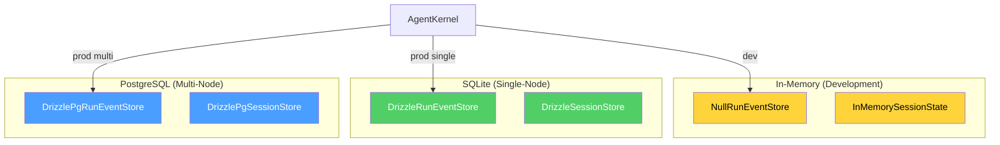

# Persistence

> Setting up database storage for sessions, events, and agents.

---

## Why Persist?

The default `NullRunEventStore` loses data on restart. For production, use durable storage.



## SQLite (Recommended for Single-Node)

```bash
npm install @vinhnt-sdk/store better-sqlite3
```

```typescript
import {
  createDb,
  applyMigrations,
  DrizzleRunEventStore,
  DrizzleSessionStore,
  DrizzleAgentStore,
  DrizzlePermissionStore,
} from "@vinhnt-sdk/store";

const db = createDb("./data/agent.sqlite");
applyMigrations(db);

const kernel = new AgentKernel({
  model,
  runEventStore: new DrizzleRunEventStore(db),
  sessionStore: new DrizzleSessionStore(db),
  agentStore: new DrizzleAgentStore(db),
  permissionStore: new DrizzlePermissionStore(db),
});
```

## PostgreSQL (Recommended for Multi-Node)

```bash
npm install @vinhnt-sdk/store pg
```

```typescript
import {
  createPgDb,
  pushPgSchema,
  DrizzlePgRunEventStore,
  DrizzlePgSessionStore,
} from "@vinhnt-sdk/store";

const db = createPgDb({
  connectionString: process.env.DATABASE_URL,
});

await pushPgSchema(db);

const kernel = new AgentKernel({
  model,
  runEventStore: new DrizzlePgRunEventStore(db),
  sessionStore: new DrizzlePgSessionStore(db),
});
```

## Store Interfaces

All stores follow interfaces from `@vinhnt-sdk/core`:

```typescript
interface RunEventStore {
  append(event: RunEvent): Promise<void>;
  getByRun(runId: RunId): Promise<RunEvent[]>;
  getBySession(sessionId: SessionId): Promise<RunEvent[]>;
}

interface SessionStore {
  save(session: Session): Promise<void>;
  get(id: SessionId): Promise<Session | null>;
  list(): Promise<Session[]>;
  delete(id: SessionId): Promise<void>;
}
```

## Custom Store Implementation

```typescript
import { RunEventStore, RunEvent } from "@vinhnt-sdk/core";

class MongoRunEventStore implements RunEventStore {
  constructor(private db: MongoClient) {}

  async append(event: RunEvent): Promise<void> {
    await this.db.db().collection("run_events").insertOne(event);
  }

  async getByRun(runId: string): Promise<RunEvent[]> {
    return this.db.db().collection("run_events").find({ runId }).toArray();
  }

  async getBySession(sessionId: string): Promise<RunEvent[]> {
    return this.db.db().collection("run_events").find({ sessionId }).toArray();
  }
}
```
