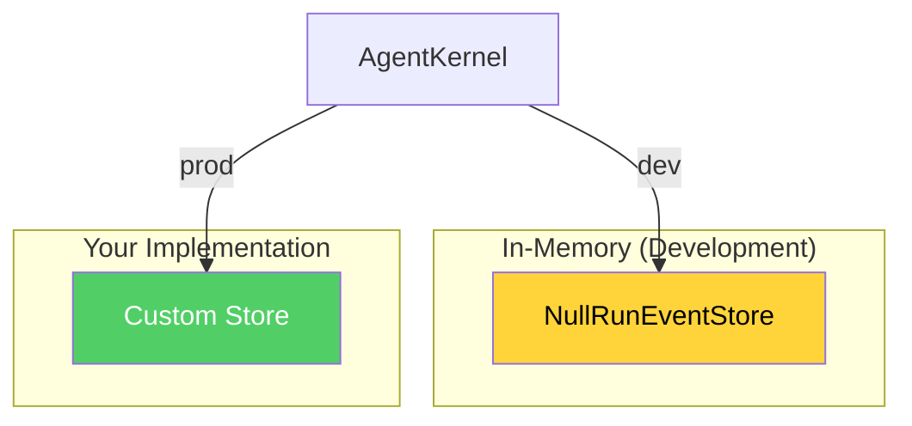

# Persistence

> Setting up database storage for sessions, events, and agents.

---

## Why Persist?

The default `NullRunEventStore` loses data on restart. For production, implement durable storage.



## Store Interfaces

All stores follow interfaces from `@vinhnt-sdk/schema`:

```typescript
interface RunEventStore {
  append(event: RunEvent): Promise<void>;
  getByRun(runId: RunId): Promise<RunEvent[]>;
  getBySession(sessionId: SessionId): Promise<RunEvent[]>;
}

interface SessionStore {
  save(session: Session): Promise<void>;
  get(id: SessionId): Promise<Session | null>;
  list(): Promise<Session[]>;
  delete(id: SessionId): Promise<void>;
}
```

## Custom Store Implementation

### SQLite with Drizzle ORM

```bash
npm install drizzle-orm better-sqlite3
npm install -D @types/better-sqlite3
```

```typescript
import { drizzle } from "drizzle-orm/better-sqlite3";
import { RunEventStore, RunEvent, SessionStore, Session } from "@vinhnt-sdk/schema";

const sqlite = drizzle("./data/agent.sqlite");

class DrizzleRunEventStore implements RunEventStore {
  async append(event: RunEvent): Promise<void> {
    await sqlite.insert(runEvents).values(event);
  }

  async getByRun(runId: string): Promise<RunEvent[]> {
    return sqlite.select().from(runEvents).where(eq(runEvents.runId, runId));
  }

  async getBySession(sessionId: string): Promise<RunEvent[]> {
    return sqlite.select().from(runEvents).where(eq(runEvents.sessionId, sessionId));
  }
}

class DrizzleSessionStore implements SessionStore {
  async save(session: Session): Promise<void> {
    await sqlite.insert(sessions).values(session);
  }

  async get(id: string): Promise<Session | null> {
    const result = await sqlite.select().from(sessions).where(eq(sessions.id, id));
    return result[0] ?? null;
  }

  async list(): Promise<Session[]> {
    return sqlite.select().from(sessions);
  }

  async delete(id: string): Promise<void> {
    await sqlite.delete(sessions).where(eq(sessions.id, id));
  }
}
```

### PostgreSQL with Drizzle ORM

```bash
npm install drizzle-orm pg
npm install -D @types/pg
```

```typescript
import { drizzle } from "drizzle-orm/node-postgres";
import { RunEventStore, RunEvent, SessionStore, Session } from "@vinhnt-sdk/schema";

const pool = new Pool({ connectionString: process.env.DATABASE_URL });
const db = drizzle(pool);

class DrizzlePgRunEventStore implements RunEventStore {
  async append(event: RunEvent): Promise<void> {
    await db.insert(runEvents).values(event);
  }

  async getByRun(runId: string): Promise<RunEvent[]> {
    return db.select().from(runEvents).where(eq(runEvents.runId, runId));
  }

  async getBySession(sessionId: string): Promise<RunEvent[]> {
    return db.select().from(runEvents).where(eq(runEvents.sessionId, sessionId));
  }
}

class DrizzlePgSessionStore implements SessionStore {
  async save(session: Session): Promise<void> {
    await db.insert(sessions).values(session);
  }

  async get(id: string): Promise<Session | null> {
    const result = await db.select().from(sessions).where(eq(sessions.id, id));
    return result[0] ?? null;
  }

  async list(): Promise<Session[]> {
    return db.select().from(sessions);
  }

  async delete(id: string): Promise<void> {
    await db.delete(sessions).where(eq(sessions.id, id));
  }
}
```

### MongoDB

```bash
npm install mongodb
```

```typescript
import { MongoClient } from "mongodb";
import { RunEventStore, RunEvent, SessionStore, Session } from "@vinhnt-sdk/schema";

const client = new MongoClient(process.env.MONGODB_URI!);
const db = client.db("agent");

class MongoRunEventStore implements RunEventStore {
  async append(event: RunEvent): Promise<void> {
    await db.collection("run_events").insertOne(event);
  }

  async getByRun(runId: string): Promise<RunEvent[]> {
    return db.collection("run_events").find({ runId }).toArray();
  }

  async getBySession(sessionId: string): Promise<RunEvent[]> {
    return db.collection("run_events").find({ sessionId }).toArray();
  }
}

class MongoSessionStore implements SessionStore {
  async save(session: Session): Promise<void> {
    await db.collection("sessions").replaceOne({ _id: session.id }, session, { upsert: true });
  }

  async get(id: string): Promise<Session | null> {
    return db.collection("sessions").findOne({ _id: id });
  }

  async list(): Promise<Session[]> {
    return db.collection("sessions").find().toArray();
  }

  async delete(id: string): Promise<void> {
    await db.collection("sessions").deleteOne({ _id: id });
  }
}
```

## Using Custom Stores

```typescript
import { AgentKernel } from "@vinhnt-sdk/core";

const kernel = new AgentKernel({
  model,
  store: new DrizzleRunEventStore(),
  sessionStore: new DrizzleSessionStore(),
});
```
