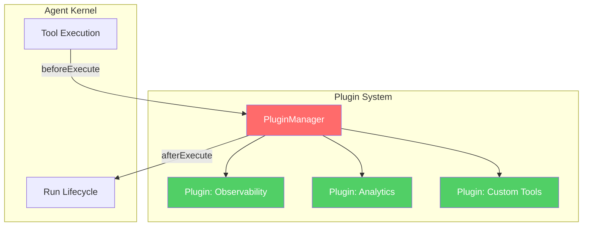

# Plugin Development

> How to write, load, and distribute plugins.

---

## What is a Plugin?

A plugin extends the agent's behavior by hooking into lifecycle events.



## Creating a Plugin

```typescript
import { definePlugin } from "@vinhnt-sdk/plugin";

const myPlugin = definePlugin(
  {
    name: "my-plugin",
    version: "1.0.0",
    description: "My custom plugin",
  },
  {
    hooks: {
      "tool:beforeExecute": async (ctx) => {
        console.log(`Tool about to run: ${ctx.toolName}`);
        return ctx.input;
      },
      "tool:afterExecute": async (ctx) => {
        console.log(`Tool completed: ${ctx.toolName}`);
      },
      "run:started": async (ctx) => {
        console.log(`Run started: ${ctx.runId}`);
      },
      "run:completed": async (ctx) => {
        console.log(`Run completed: ${ctx.runId}`);
      },
    },
    activate: async (ctx) => {
      console.log("Plugin activated!");
    },
    deactivate: async () => {
      console.log("Plugin deactivated!");
    },
  }
);
```

## Available Hooks

| Hook | When | Use Case |
|------|------|----------|
| `tool:beforeExecute` | Before tool runs | Validate input, logging |
| `tool:afterExecute` | After tool succeeds | Metrics, caching |
| `tool:failed` | After tool fails | Error handling, retry |
| `run:started` | Run begins | Initialize context |
| `run:completed` | Run ends | Cleanup, metrics |
| `context:compressed` | Context compacted | Memory management |

## Registering Plugins

```typescript
import { AgentKernel, DefaultPluginManager } from "@vinhnt-sdk/core";

const pluginManager = new DefaultPluginManager();
pluginManager.register(myPlugin);

const kernel = new AgentKernel({ model, pluginManager });
```

## Loading from npm

```typescript
import { loadPluginFromNpm } from "@vinhnt-sdk/plugin/npm-loader";

const plugin = await loadPluginFromNpm("@vinhnt-sdk/otel");
pluginManager.register(plugin);
```

## Publishing a Plugin

```json
{
  "name": "my-agent-plugin",
  "version": "1.0.0",
  "main": "dist/index.js",
  "peerDependencies": {
    "@vinhnt-sdk/core": ">=0.1.0"
  }
}
```
