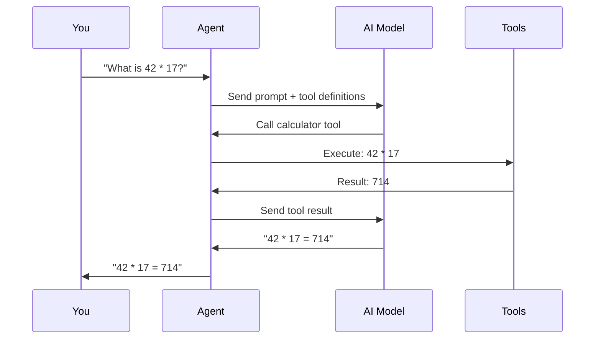

# Quick Start

> Get a working agent in under 5 minutes.

---

## Prerequisites

- Node.js 18+
- npm, pnpm, or yarn
- An API key from an AI provider (OpenAI, Anthropic, etc.)

## Flow



## 1. Install Dependencies

```bash
# Core packages (minimum)
npm install @vinhnt-sdk/core @vinhnt-sdk/schema @vinhnt-sdk/adapters

# AI SDK peer dependency
npm install ai @ai-sdk/openai

# Dev tools
npm install -D tsx typescript
```

## 2. Create Your First Agent

```typescript
// agent.ts
import { AgentKernel, NullRunEventStore, defineTool } from "@vinhnt-sdk/core";
import { createModelProvider } from "@vinhnt-sdk/adapters";
import { z } from "zod";

// Step 1: Define a tool
const calculatorTool = defineTool({
  name: "calculator",
  description: "Perform basic arithmetic",
  risk: "low",
  input: z.object({
    operation: z.enum(["add", "subtract", "multiply", "divide"]),
    a: z.number(),
    b: z.number(),
  }),
  execute: async (input) => {
    const results = {
      add: input.a + input.b,
      subtract: input.a - input.b,
      multiply: input.a * input.b,
      divide: input.a / input.b,
    };
    return { result: results[input.operation] };
  },
});

// Step 2: Create model provider
const model = createModelProvider("openai", "gpt-4o", {
  apiKey: process.env.OPENAI_API_KEY!,
});

// Step 3: Create kernel
const kernel = new AgentKernel({
  model,
  tools: [calculatorTool],
  store: new NullRunEventStore(),
});

// Step 4: Run
async function main() {
  const prompt = process.argv[2] || "What is 42 * 17?";
  console.log(`Prompt: ${prompt}\n`);

  const handle = kernel.run(prompt);

  for await (const event of handle.events) {
    if (event.type === "tool.invoked") {
      console.log(`  Tool: ${event.data.toolName}`);
    }
    if (event.type === "tool.completed") {
      console.log(`  Result: ${JSON.stringify(event.data.result)}`);
    }
  }

  const result = await handle.completed;
  console.log(`\nAnswer: ${result}`);
}

main();
```

## 3. Run It

```bash
OPENAI_API_KEY=sk-... npx tsx agent.ts "What is 42 * 17?"
```

## Expected Output

```
Prompt: What is 42 * 17?

  Tool: calculator
  Result: {"result":714}

Answer: 42 * 17 = 714
```

---

## Next Steps

- [Installation Guide](./installation.md) — Detailed setup options
- [Configuration](./configuration.md) — Config file format
- [Creating Tools](./creating-tools.md) — Advanced tool patterns
- [NestJS Integration](./nestjs-integration.md) — Build a full API backend
- [Architecture](./architecture.md) — How the system fits together
